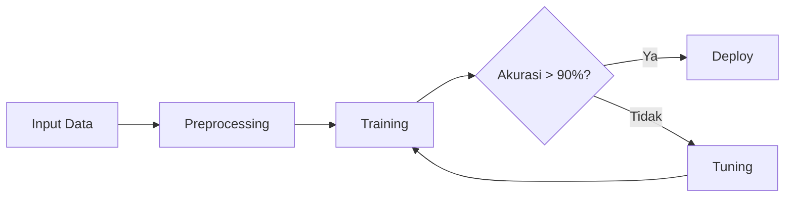
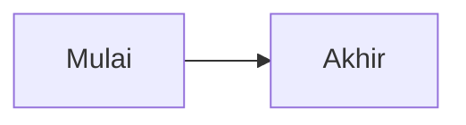

# Panduan Menulis Course — smauii-dev-content

Dokumen ini adalah panduan lengkap untuk kontributor konten. Sebelum menulis satu baris pun, baca dokumen ini sampai selesai.

---

## Filosofi Konten

Konten di repo ini bukan sekadar tutorial copy-paste dari internet. Setiap lesson harus:

1. **Contextual** — dikaitkan dengan konteks nyata siswa SMA UII (kompetisi OPSI, OSN, proyek nyata, industri lokal)
2. **Practical** — setiap konsep ada kode yang bisa langsung dijalankan
3. **Progressive** — dibangun di atas lesson sebelumnya, tidak ada "loncat"
4. **Honest** — akui keterbatasan, tunjukkan tradeoff, jangan oversimplify

---

## Struktur Konten yang Ideal

### Hierarki

```
Track               → Bidang besar (Software Engineering, AI, dll)
  └── Modul         → Topik dalam bidang (Git & GitHub, Machine Learning, dll)
        └── Lesson  → Satu konsep spesifik yang bisa dipelajari dalam 1 sesi
```

### Ukuran yang Tepat

| Level | Durasi | Jumlah Konsep | Jumlah Latihan |
|-------|--------|---------------|----------------|
| Lesson beginner | 15-25 menit | 1-2 | 1 |
| Lesson intermediate | 25-45 menit | 2-3 | 1-2 |
| Lesson advanced | 45-75 menit | 3-5 | 2-3 |

> **Aturan praktis:** Jika kamu butuh scroll lebih dari 3x untuk membaca lesson, pecah menjadi 2 lesson.

---

## Anatomy Lesson yang Ideal

Setiap lesson wajib mengikuti struktur ini:

```markdown
---
[frontmatter — lihat spesifikasi di bawah]
---

# Judul Lesson

Satu paragraf pengantar: apa yang akan dipelajari dan MENGAPA ini penting.
Hubungkan dengan dunia nyata atau konteks siswa SMA.

## [Konsep 1]

Penjelasan konsep dengan analogi sederhana sebelum masuk ke teknis.

[diagram/visualisasi jika relevan]

[code example yang minimal tapi lengkap]

> **Catatan/Tips/Warning** — informasi penting yang sering terlewat

## [Konsep 2]

...

## [Konsep N]

...

## Rangkuman

Poin-poin kunci dalam 3-5 bullet. Siswa yang sudah paham bisa skip ke sini.

## Latihan

[Satu atau lebih latihan yang bisa diselesaikan dalam waktu lesson]
```

---

## Spesifikasi Frontmatter

### Track README (`tracks/<track>/README.md`)

```yaml
---
title: "Nama Track"                    # Wajib
description: "1-2 kalimat deskripsi"   # Wajib
icon: "💻"                             # Emoji, wajib
order: 1                               # Urutan di listing, wajib
tags: [tag1, tag2]                     # Opsional
---
```

### Modul README (`tracks/<track>/<modul>/README.md`)

```yaml
---
title: "Nama Modul"                    # Wajib
track: nama-track                      # Wajib, harus match nama folder track
order: 1                               # Urutan dalam track, wajib
description: "1-2 kalimat"            # Direkomendasikan
---
```

### Lesson (`.md` biasa)

```yaml
---
title: "Judul Lesson"                  # Wajib
track: nama-track                      # Wajib
module: nama-modul                     # Wajib, harus match nama folder modul
order: 1                               # Urutan dalam modul, wajib
level: beginner                        # Wajib: beginner | intermediate | advanced
duration: 25                           # Wajib: estimasi menit, jujur!
prerequisites:                         # Direkomendasikan
  - tracks/nama-track/modul/lesson     # Slug lesson yang harus diselesaikan dulu
tags: [git, version-control]           # Direkomendasikan, 2-5 tag
author: github-username                # Wajib
updated: YYYY-MM-DD                    # Wajib, update setiap revisi
---
```

### Level Guidelines

**beginner** — Tidak butuh pengetahuan sebelumnya di topik ini. Analogi sehari-hari lebih banyak dari kode.

**intermediate** — Butuh pemahaman konsep dasar. Kode lebih kompleks, ada tradeoff yang dibahas.

**advanced** — Butuh pengalaman praktis. Optimasi, edge cases, production considerations.

---

## Standar Kualitas Code Examples

### ✅ Yang Benar

```python
# Kode ini bisa dijalankan langsung — tidak ada placeholder
import numpy as np

data = [72, 85, 90, 68, 75, 85, 92]
rata_rata = np.mean(data)
std_dev = np.std(data, ddof=1)

print(f"Rata-rata: {rata_rata:.1f}")
print(f"Std Dev: {std_dev:.2f}")
```

### ❌ Yang Salah

```python
# Kode dengan placeholder yang tidak jelas
result = some_function(YOUR_DATA_HERE)
process(result, PARAMETER_1, PARAMETER_2)
```

### Aturan Kode

1. **Bisa dijalankan langsung** — tidak ada placeholder `...` atau `# TODO`
2. **Minimal tapi lengkap** — tidak ada kode yang tidak relevan dengan konsep
3. **Ada output** — tunjukkan apa yang dihasilkan, baik sebagai komentar atau print statement
4. **Error handling** — untuk kode production, tunjukkan cara handle error
5. **Bahasa konsisten** — variabel/komentar dalam Bahasa Indonesia jika memungkinkan

---

## Standar Diagram (Mermaid)

Gunakan diagram untuk hal yang sulit dijelaskan dengan teks. Jangan diagram untuk sekedar dekorasi.

### Kapan Pakai Diagram

| Situasi | Tipe Diagram |
|---------|-------------|
| Alur proses/algoritma | `flowchart` atau `graph` |
| Sequence komunikasi antar sistem | `sequenceDiagram` |
| Hubungan antar entitas | `graph` |
| Timeline | `gantt` |
| State machine | `stateDiagram` |
| Arsitektur git | `gitGraph` |

### Standar Visual

```markdown
# ✅ Diagram yang informatif


# ❌ Diagram yang redundant (bisa diganti teks biasa)

```

---

## Standar Matematika (LaTeX)

Gunakan LaTeX hanya untuk rumus yang tidak bisa diekspresikan dengan teks biasa.

```markdown
# ✅ Tepat sasaran
Gradient descent mengupdate parameter menggunakan:

$$\theta_{t+1} = \theta_t - \alpha \nabla_\theta J(\theta_t)$$

Di mana $\alpha$ adalah learning rate dan $\nabla_\theta J$ adalah gradient loss.

# ❌ Berlebihan — bisa pakai teks biasa
Mean dari array $[1, 2, 3]$ adalah $\frac{1+2+3}{3} = 2$.
```

Untuk rumus inline, gunakan `$...$`. Untuk display equation, gunakan `$$...$$`.

---

## Struktur Latihan yang Baik

Latihan bukan sekadar "coba sendiri" — harus spesifik dan terukur.

### ❌ Latihan yang Buruk

> Coba buat program Python yang menganalisis data.

### ✅ Latihan yang Baik

> **Latihan: Analisis Distribusi Nilai**
>
> Dataset: Download [Student Performance Dataset](https://kaggle.com/...) dari Kaggle
>
> 1. Load CSV dengan Pandas — berapa baris dan kolom?
> 2. Identifikasi kolom dengan missing values terbanyak
> 3. Plot histogram nilai matematika — apakah distribusinya normal?
> 4. Bandingkan nilai rata-rata antara siswa yang punya akses internet vs tidak
>
> **Output yang diharapkan:** Notebook Jupyter dengan 4 visualisasi dan 1 paragraf kesimpulan per visualisasi.

### Kriteria Latihan yang Baik

- **Spesifik** — ada dataset/tools yang jelas, bukan abstrak
- **Terukur** — ada output yang bisa diverifikasi
- **Relevan** — langsung terhubung ke konsep yang baru dipelajari
- **Realistis** — bisa diselesaikan dalam 30-60 menit
- **Bertahap** — mulai dari yang mudah, naik ke yang kompleks

---

## Capstone Project per Modul

Setiap modul **harus** diakhiri dengan satu lesson capstone yang mengintegrasikan semua lesson dalam modul. Format:

```markdown
---
title: "Proyek: [Nama Proyek]"
track: nama-track
module: nama-modul
order: 99          # Selalu yang terakhir
level: intermediate
duration: 120      # Proyek lebih lama
prerequisites:
  - [semua lesson dalam modul ini]
tags: [proyek, capstone]
author: github-username
updated: YYYY-MM-DD
---

# Proyek: [Nama Proyek]

## Deskripsi

[1-2 paragraf tentang proyek, konteks nyata, dan relevansinya]

## Yang Akan Dibangun

[Screenshot/mockup/deskripsi output akhir]

## Prasyarat

Pastikan kamu sudah menyelesaikan:
- [ ] Lesson 1: ...
- [ ] Lesson 2: ...
- [ ] Lesson 3: ...

## Langkah-langkah

### Fase 1: Setup (30 menit)
...

### Fase 2: Implementasi (60 menit)
...

### Fase 3: Polish & Deploy (30 menit)
...

## Kriteria Keberhasilan

- [ ] Fitur A berjalan dengan benar
- [ ] Fitur B berjalan dengan benar
- [ ] Kode terdokumentasi dengan baik
- [ ] Di-deploy dan bisa diakses publik

## Tantangan Ekstra

[Untuk yang sudah selesai lebih cepat]

## Referensi

- [Link dokumentasi resmi]
- [Link tutorial tambahan]
```

---

## Konvensi Naming

```
tracks/
  software-engineering/           # kebab-case, tanpa nomor
    README.md
    01-git-github/                 # NN-nama-modul
      README.md
      01-apa-itu-git.md            # NN-judul-lesson.md
      02-github-kolaborasi.md
      03-branching-workflow.md
      99-proyek-portfolio-github.md  # Capstone selalu 99
    02-web-fundamentals/
      ...
```

**Aturan naming:**
- Huruf kecil semua
- Pisah kata dengan `-` (kebab-case)
- Folder modul: `NN-nama-modul` (2 digit, mulai dari 01)
- File lesson: `NN-judul-lesson.md` (2 digit, mulai dari 01)
- Capstone: `99-proyek-nama.md`
- Tidak boleh ada spasi atau karakter spesial

---

## Workflow Kontribusi

### Untuk Lesson Baru

```bash
# 1. Fork repo smauii-dev-content
# 2. Clone fork kamu
git clone git@github.com:USERNAME/smauii-dev-content.git
cd smauii-dev-content

# 3. Buat branch
git checkout -b feat/se-lesson-typescript-advanced

# 4. Buat file lesson
mkdir -p tracks/software-engineering/04-framework-modern
# Tulis konten...

# 5. Validasi frontmatter
# Pastikan semua field wajib ada

# 6. Test render lokal (jika setup dev environment)
bun run dev  # Di repo smauii-dev-foundation

# 7. Commit dengan conventional commits
git add tracks/software-engineering/04-framework-modern/04-typescript-advanced.md
git commit -m "feat(software-engineering): tambah lesson TypeScript advanced — generics dan utility types"

# 8. Push dan buat PR
git push origin feat/se-lesson-typescript-advanced
```

### Format Commit Message

```
feat(track-name): tambah lesson [judul]
fix(track-name): perbaiki error kode di [judul]
docs(track-name): update frontmatter [judul]
refactor(track-name): pecah lesson [judul] menjadi 2 lesson
```

### Checklist Sebelum PR

```
[ ] Frontmatter lengkap (semua field wajib)
[ ] Kode bisa dijalankan langsung (tidak ada placeholder)
[ ] Diagram relevan dan tidak dekoratif
[ ] Latihan spesifik dan terukur
[ ] Tidak ada typo (jalankan spell checker)
[ ] Naming convention sesuai
[ ] order di frontmatter tidak konflik dengan lesson lain
[ ] prerequisites diisi jika ada ketergantungan
[ ] Bahasa Indonesia yang baik dan benar
```

---

## Hal yang Harus Dihindari

### ❌ Anti-patterns yang sering terjadi

**1. Terlalu banyak konsep dalam satu lesson**
```
# Buruk: satu lesson membahas HTTP, HTTPS, REST, GraphQL, WebSocket
# Baik: satu lesson fokus HTTP dasar, lesson berikutnya REST API
```

**2. Copy-paste dari dokumentasi resmi tanpa adaptasi**
```
# Buruk: salin langsung dari docs.python.org
# Baik: tulis ulang dengan contoh konteks Indonesia/SMA UII
```

**3. Kode yang tidak bisa dijalankan**
```python
# Buruk
model = YourModel()
data = load_your_data()

# Baik
from sklearn.datasets import load_iris
from sklearn.ensemble import RandomForestClassifier

data = load_iris()
model = RandomForestClassifier(n_estimators=100)
model.fit(data.data, data.target)
```

**4. Latihan tanpa kriteria keberhasilan**
```
# Buruk
Coba eksplorasi dataset ini.

# Baik
Buat fungsi yang menerima DataFrame dan mengembalikan
dict berisi: mean, median, std untuk setiap kolom numerik.
Test dengan dataset iris — output harus match nilai berikut: {...}
```

**5. Level yang tidak sesuai**
```
# Lesson berlabel "beginner" tapi langsung pakai async/await
# tanpa penjelasan event loop — mislabeling level
```

---

## Contoh Lesson yang Ideal

Berikut adalah contoh lesson yang memenuhi semua standar di atas:

```markdown
---
title: "Git Commit yang Baik"
track: software-engineering
module: 01-git-github
order: 4
level: beginner
duration: 20
prerequisites:
  - software-engineering/01-git-github/01-apa-itu-git
  - software-engineering/01-git-github/02-github-kolaborasi
tags: [git, commit, conventional-commits, best-practices]
author: sandikodev
updated: 2026-04-17
---

# Git Commit yang Baik

Commit bukan sekadar "simpan perubahan" — ini adalah catatan sejarah proyek yang harus bisa dibaca 2 tahun kemudian oleh kamu sendiri atau orang lain.

## Anatomi Commit yang Buruk

```bash
git log --oneline
# abc1234 fix
# def5678 update
# ghi9012 wip
# jkl3456 asdfgh
```

Kamu tidak tahu apa yang berubah tanpa membuka setiap commit.

## Conventional Commits

Format standar industri:

```
<type>(<scope>): <deskripsi singkat>

[body opsional]

[footer opsional]
```

| Type | Kapan dipakai |
|------|--------------|
| `feat` | Fitur baru |
| `fix` | Bug fix |
| `docs` | Perubahan dokumentasi saja |
| `refactor` | Restrukturisasi kode tanpa ubah fungsionalitas |
| `test` | Tambah atau perbaiki test |
| `chore` | Update dependency, konfigurasi |

### Contoh Nyata

```bash
# ✅ Baik
git commit -m "feat(auth): tambah login dengan GitHub OAuth"
git commit -m "fix(api): perbaiki error 500 saat upload file kosong"
git commit -m "docs(readme): update instruksi instalasi untuk Windows"

# ❌ Buruk
git commit -m "fix"
git commit -m "update file"
git commit -m "done"
```

## Atomic Commits

Satu commit = satu perubahan logis yang kohesif.

```bash
# ❌ Terlalu banyak dalam satu commit
git add .
git commit -m "feat: login, register, forgot password, profile page"

# ✅ Dipecah
git add src/pages/login.astro
git commit -m "feat(auth): implementasi halaman login"

git add src/pages/register.astro
git commit -m "feat(auth): implementasi halaman register"
```

## Rangkuman

- Commit message harus menjelaskan **apa** dan **mengapa**, bukan **bagaimana**
- Gunakan format Conventional Commits untuk konsistensi
- Satu commit = satu perubahan logis
- Tulis dalam present tense: "add feature" bukan "added feature"

## Latihan

Buka repo GitHub-mu (atau buat baru):
1. Buat 3 commit dengan pesan yang buruk
2. Gunakan `git rebase -i HEAD~3` untuk edit pesan commit
3. Ubah ketiganya menjadi Conventional Commits yang baik
4. Push dan cek apakah history terlihat lebih rapi
```

---

## Pertanyaan yang Sering Ditanyakan

**Q: Boleh nulis dalam bahasa Inggris?**
A: Tidak. Semua konten harus dalam Bahasa Indonesia. Istilah teknis (seperti "branch", "commit", "array") boleh tetap dalam bahasa Inggris.

**Q: Berapa panjang lesson yang ideal?**
A: Bisa dibaca dan dipraktikkan dalam satu sesi duduk (15-75 menit). Jika lebih, pecah.

**Q: Bagaimana kalau ada konsep yang butuh prereq dari track lain?**
A: Tulis di `prerequisites` dengan full slug: `software-engineering/01-git-github/01-apa-itu-git`. Jika banyak, pertimbangkan apakah lesson ini salah penempatan track.

**Q: Boleh tambah gambar/screenshot?**
A: Boleh. Simpan di folder `assets/` dalam modul yang sama. Gunakan dengan path relatif: ``. Maksimal resolusi 1200px wide, format PNG atau WebP.

**Q: Bagaimana kalau saya menemukan error di lesson orang lain?**
A: Buat issue di GitHub dengan label `bug` dan tag author-nya. Atau langsung buat PR dengan fix.

---

## Roadmap Konten yang Dibutuhkan

Berikut lesson-lesson yang masih kosong dan perlu diisi. Ambil yang sesuai dengan keahlianmu:

### Software Engineering
- [ ] `01-git-github/04-git-advanced` — interactive rebase, bisect, stash
- [ ] `01-git-github/99-proyek-portfolio-github` — capstone: setup GitHub profile yang keren
- [ ] `02-web-fundamentals/04-css-modern` — CSS Grid lanjutan, custom properties, animations
- [ ] `03-javascript/04-typescript-intro` — basic types, interface, generics
- [ ] `04-framework-modern/04-state-management` — Zustand, Jotai, atau Context API
- [ ] `04-framework-modern/99-proyek-portofolio` — capstone: buat portfolio pribadi
- [ ] `05-open-source/02-writing-good-issues` — bug report, feature request, discussion

### AI
- [ ] `01-pengantar-ai/03-python-untuk-ai` — numpy, matplotlib, Jupyter basics
- [ ] `02-machine-learning/04-model-evaluation` — confusion matrix, ROC, cross-validation
- [ ] `04-computer-vision/03-mediapipe` — pose estimation, hand tracking
- [ ] `05-nlp/03-fine-tuning-indobert` — fine-tune untuk sentiment Bahasa Indonesia

### Data Science
- [ ] `01-pengantar-data/02-data-ethics` — bias, privasi, GDPR
- [ ] `02-statistik/03-bayesian-statistics` — Bayes theorem, prior/posterior
- [ ] `05-ml-terapan/04-model-deployment` — FastAPI + Docker untuk serve model

### Jaringan Komputer
- [ ] `03-linux-server/03-nginx-advanced` — reverse proxy, caching, rate limiting
- [ ] `05-devops/03-kubernetes-intro` — pods, deployments, services

### Keamanan Siber
- [ ] `03-web-security/03-api-security` — JWT attacks, OAuth misconfig, API key exposure
- [ ] `04-ctf/03-binary-exploitation` — buffer overflow dasar

### Robotika/IoT
- [ ] `01-elektronika-dasar/03-pcb-design` — KiCad basics, dari breadboard ke PCB
- [ ] `03-sensor-aktuator/03-display-oled` — I2C OLED, tampilkan data sensor
- [ ] `05-proyek-robot/04-autonomous-navigation` — mapping sederhana dengan multiple sensor

---

*Dokumen ini adalah living document — update setiap ada perubahan standar atau best practice baru.*

*Pertanyaan? Buka discussion di [GitHub Discussions](https://github.com/SMA-UII-Yogyakarta/smauii-dev-content/discussions).*
