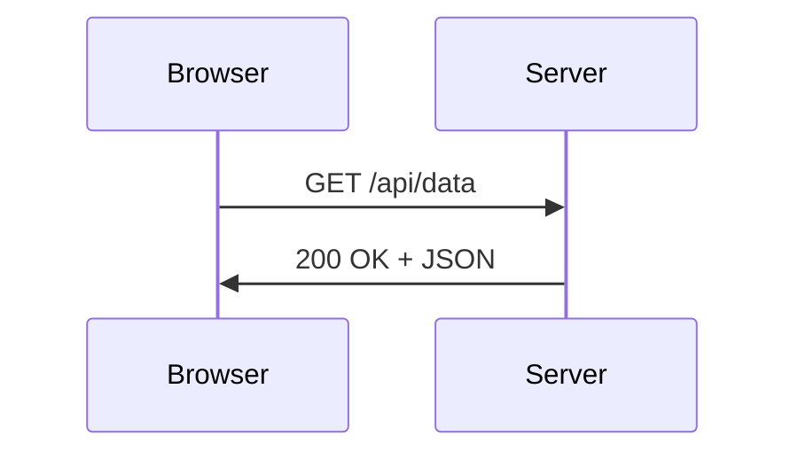

<div align="center">

# 📚 smauii-dev-content

**Konten pembelajaran open source untuk [Digital Lab SMA UII Yogyakarta](https://lab.smauiiyk.sch.id)**

*Ditulis oleh komunitas · Untuk komunitas · Bisa diaudit siapa saja*

[](./tracks)
[](./tracks)
[](./LICENSE)
[](./CONTRIBUTING.md)

[🌐 Baca Online](https://lab.smauiiyk.sch.id/learn) &nbsp;·&nbsp; [🤝 Cara Kontribusi](./CONTRIBUTING.md) &nbsp;·&nbsp; [🐛 Laporkan Error](https://github.com/SMA-UII-Yogyakarta/smauii-dev-content/issues)

</div>

---

## Kenapa Open Source?

Konten pembelajaran yang baik seharusnya **transparan, bisa diaudit, dan bisa dikembangkan bersama**. Dengan menyimpan konten di GitHub:

- Setiap perubahan tercatat — kamu bisa lihat siapa menulis apa dan kapan
- Kesalahan bisa dilaporkan dan diperbaiki oleh siapapun via Issues/PR
- Siswa, alumni, dan guru bisa berkontribusi materi baru
- Konten bisa dibaca langsung di GitHub tanpa perlu login ke platform

---

## Track yang Tersedia

| | Track | Modul | Lesson | Mulai dari |
|--|-------|-------|--------|-----------|
| 💻 | [Software Engineering](./tracks/software-engineering) | 5 | 13 | Git & GitHub |
| 🧠 | [AI (Kecerdasan Buatan)](./tracks/ai) | 5 | 12 | Pengantar AI |
| 📊 | [Data Science](./tracks/data-science) | 5 | 12 | Pipeline Data |
| 🌐 | [Jaringan Komputer](./tracks/jaringan-komputer) | 5 | 12 | OSI & TCP/IP |
| 🔐 | [Keamanan Siber](./tracks/keamanan-siber) | 5 | 12 | CIA Triad |
| 🤖 | [Robotika & IoT](./tracks/robotika-iot) | 5 | 12 | Elektronika Dasar |
| 🎨 | [Desain UI/UX](./tracks/desain-uiux) | 5 | 13 | Prinsip Desain |
| 📣 | [Digital Marketing](./tracks/digital-marketing) | 5 | 18 | Strategi & Funnel |
| 🗺️ | [Peta Karir](./tracks/peta-karir) | 5 | 12+ | Mindset Dasar |

Setiap track dirancang untuk membawa kamu dari **nol** sampai bisa **berkontribusi ke proyek nyata**.

> **Track tidak terbatas.** Siapapun bisa mengusulkan atau membuat track baru — lihat [CONTRIBUTING.md](./CONTRIBUTING.md) untuk caranya.

---

## Fitur Konten

Setiap lesson mendukung rendering penuh di platform:

**LaTeX** — notasi matematika dan rumus ilmiah
```
$$\theta = \theta - \alpha \nabla_\theta J(\theta)$$
```

**Mermaid** — diagram, flowchart, sequence diagram
````

````

**Syntax Highlighting** — 100+ bahasa dengan tema gelap

````
```python
model.fit(X_train, y_train)
predictions = model.predict(X_test)
```
````

---

## Struktur Repo

```
tracks/
  software-engineering/
  │   README.md                    ← Deskripsi track & roadmap
  │   01-git-github/
  │   │   README.md                ← Deskripsi modul
  │   │   01-apa-itu-git.md
  │   │   02-github-kolaborasi.md
  │   │   03-branching-workflow.md
  │   │   99-proyek-portfolio.md   ← Capstone project
  │   02-web-fundamentals/
  │   └── ...
  ai/
  data-science/
  jaringan-komputer/
  keamanan-siber/
  └── robotika-iot/
```

**Konvensi naming:**
- Folder: `NN-nama-topik` (angka 2 digit + kebab-case)
- File lesson: `NN-judul-lesson.md`
- Capstone: `99-proyek-nama.md`

---

## Frontmatter Lesson

Setiap lesson dimulai dengan metadata:

```yaml
---
title: "Apa itu Git?"
track: software-engineering
module: 01-git-github
order: 1
level: beginner           # beginner | intermediate | advanced
duration: 20              # estimasi menit
prerequisites: []         # slug lesson yang harus diselesaikan dulu
tags: [git, version-control]
author: sandikodev
updated: 2026-04-17
---
```

Untuk `README.md` track dan modul, frontmatter lebih sederhana — lihat detail di [CONTRIBUTING.md](./CONTRIBUTING.md#spesifikasi-frontmatter).

---

## Kontribusi

Kami menyambut kontribusi dari **siapapun** — siswa, alumni, guru, atau developer yang peduli pendidikan teknologi Indonesia.

### Setup & Analisis Konten

Tidak perlu install dependency apapun — cukup Node.js:

```bash
# Clone repo
git clone https://github.com/SMA-UII-Yogyakarta/smauii-dev-content.git
cd smauii-dev-content

# Lihat semua konten yang ada (dengan statistik)
node analyze.mjs

# Lihat slot kosong yang butuh kontribusi ← mulai dari sini!
node analyze.mjs --missing

# Output JSON untuk integrasi tools lain
node analyze.mjs --json
```

### Mulai Cepat

```bash
# Fork, clone, buat branch
git checkout -b feat/software-engineering-lesson-docker

# Tulis lesson (ikuti template di CONTRIBUTING.md)
# Test render di repo utama: bun run dev

# Commit dan PR
git commit -m "feat(software-engineering): tambah lesson Docker dasar"
```

### Yang Paling Dibutuhkan Saat Ini

- 🚀 **Capstone project** untuk setiap modul (format ada di [CONTRIBUTING.md](./CONTRIBUTING.md))
- 🇮🇩 **Contoh yang lebih lokal** — gunakan dataset/konteks Indonesia
- 🐛 **Review kode** — pastikan semua code example bisa dijalankan
- 📝 **Lesson yang masih kosong** — lihat [roadmap](./CONTRIBUTING.md#roadmap-konten-yang-dibutuhkan)

Baca **[CONTRIBUTING.md](./CONTRIBUTING.md)** sebelum mulai — ada panduan lengkap standar penulisan, checklist, dan anti-patterns yang harus dihindari.

---

## Dokumen Penting

| Dokumen | Isi |
|---------|-----|
| [CONTRIBUTING.md](./CONTRIBUTING.md) | Panduan lengkap menulis lesson — wajib dibaca |
| [CONTENT_STANDARDS.md](./CONTENT_STANDARDS.md) | Checklist dan rubrik kualitas |
| [CHANGELOG.md](./CHANGELOG.md) | Histori perubahan konten |
| [CODE_OF_CONDUCT.md](./CODE_OF_CONDUCT.md) | Kode etik komunitas |
| [LICENSE](./LICENSE) | CC BY-SA 4.0 |

---

## Lisensi

Konten di repo ini dilisensikan di bawah **[Creative Commons Attribution-ShareAlike 4.0](./LICENSE)**.

Bebas digunakan, dimodifikasi, dan didistribusikan — dengan syarat mencantumkan atribusi dan lisensi turunan sama.

---

<div align="center">

Dibuat dengan ❤️ oleh **komunitas SMAUII Developer Foundation**

[lab.smauiiyk.sch.id](https://lab.smauiiyk.sch.id) &nbsp;·&nbsp; [GitHub Org](https://github.com/SMA-UII-Yogyakarta) &nbsp;·&nbsp; Yogyakarta, Indonesia

</div>
