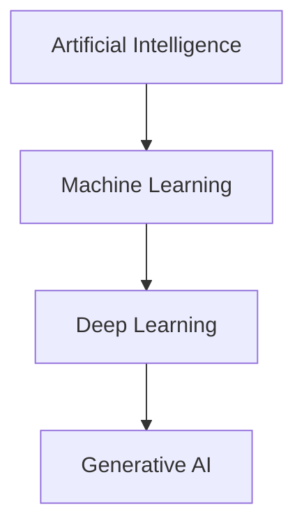

# Apa itu Kecerdasan Buatan?

AI (Artificial Intelligence) adalah kemampuan mesin untuk meniru kecerdasan manusia — belajar, bernalar, memecahkan masalah, dan memahami bahasa.

## Hierarki AI

- **AI** — Bidang luas: sistem yang berperilaku cerdas
- **ML** — Subset AI: sistem yang belajar dari data
- **Deep Learning** — Subset ML: menggunakan neural network berlapis
- **Generative AI** — Subset DL: menghasilkan konten baru (teks, gambar, kode)

## Tipe AI

### Berdasarkan Kemampuan

| Tipe | Deskripsi | Contoh |
|------|-----------|--------|
| Narrow AI | Ahli di satu tugas | ChatGPT, AlphaGo, FaceID |
| General AI | Setara manusia | Belum ada |
| Super AI | Melampaui manusia | Fiksi ilmiah |

### Berdasarkan Cara Belajar

- **Supervised Learning** — Belajar dari data berlabel
- **Unsupervised Learning** — Temukan pola tanpa label
- **Reinforcement Learning** — Belajar dari reward/punishment

## Aplikasi AI Saat Ini

- **Computer Vision** — FaceID, self-driving car, deteksi kanker
- **NLP** — ChatGPT, Google Translate, Siri
- **Rekomendasi** — Netflix, Spotify, TikTok
- **Game** — AlphaGo, OpenAI Five
- **Robotika** — Boston Dynamics, robot industri

## Matematika di Balik AI

AI sangat bergantung pada matematika:

**Aljabar Linear** — Representasi data sebagai vektor/matriks:
$$\mathbf{y} = \mathbf{W}\mathbf{x} + \mathbf{b}$$

**Kalkulus** — Optimasi model via gradient descent:
$$\theta = \theta - \alpha \nabla_\theta J(\theta)$$

**Statistik & Probabilitas** — Ketidakpastian dan distribusi:
$$P(A|B) = \frac{P(B|A) \cdot P(A)}{P(B)}$$

## Latihan

1. Cari 3 aplikasi AI yang kamu gunakan sehari-hari
2. Identifikasi: termasuk tipe apa? (Computer Vision, NLP, Rekomendasi?)
3. Coba [Teachable Machine](https://teachablemachine.withgoogle.com/) — latih model klasifikasi gambar tanpa kode
