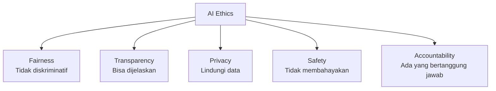

# AI Ethics & Responsible AI

Seiring AI semakin powerful, pertanyaan etis menjadi semakin penting — siapa yang bertanggung jawab jika AI melakukan kesalahan?

## Masalah Utama AI Ethics

### 1. Bias dalam Data

AI belajar dari data historis — jika data bias, model juga bias:

```python
# Contoh: model rekrutmen yang bias gender
from sklearn.ensemble import RandomForestClassifier
import pandas as pd

# Training data historis (kebanyakan karyawan pria dipromosikan)
df = pd.DataFrame({
    'pengalaman': [5, 3, 7, 2, 8, 4, 6, 1],
    'pendidikan': [2, 1, 3, 1, 3, 2, 3, 1],
    'gender': [1, 0, 1, 0, 1, 0, 1, 0],  # 1=pria, 0=wanita
    'dipromosikan': [1, 0, 1, 0, 1, 0, 1, 0]  # Semua pria dipromosikan!
})

model = RandomForestClassifier()
model.fit(df[['pengalaman', 'pendidikan', 'gender']], df['dipromosikan'])

# Model akan bias terhadap gender!
# Solusi: hapus fitur gender, atau gunakan fairness-aware ML
```

### 2. Explainability (XAI)

Model "black box" sulit diaudit:

```python
import shap

# SHAP — explain predictions
explainer = shap.TreeExplainer(model)
shap_values = explainer.shap_values(X_test)

# Visualisasi kontribusi tiap fitur
shap.summary_plot(shap_values, X_test)
shap.force_plot(explainer.expected_value[1], shap_values[1][0], X_test.iloc[0])
```

### 3. Privacy

```python
# Differential Privacy — lindungi data individual
from diffprivlib.models import LogisticRegression

# Model dengan differential privacy guarantee
model_dp = LogisticRegression(epsilon=1.0)  # epsilon = privacy budget
model_dp.fit(X_train, y_train)
```

## Framework AI Ethics



## Regulasi AI

- **EU AI Act (2024)** — klasifikasi risiko: unacceptable, high, limited, minimal
- **UNESCO AI Ethics (2021)** — rekomendasi global
- **Indonesia** — PP No. 71/2019 tentang tata kelola teknologi

## Latihan

1. Analisis bias dalam dataset rekrutmen (Kaggle: "HR Analytics")
2. Implementasi SHAP untuk model klasifikasi
3. Diskusi: AI di bidang apa yang paling berisiko? Bagaimana mitigasinya?
