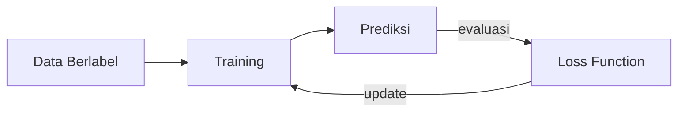
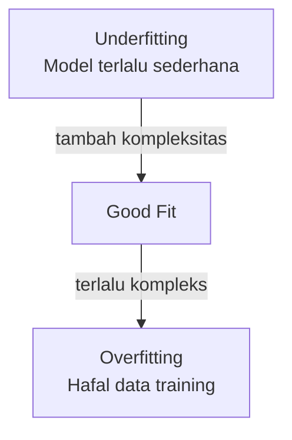

# Supervised Learning

Supervised learning adalah paradigma ML di mana model belajar dari data yang sudah diberi label.

## Konsep Dasar



**Input (X)** → **Model** → **Output (ŷ)** → bandingkan dengan **Label (y)** → update model

## Dua Jenis Utama

### 1. Regresi — Prediksi Nilai Kontinu

Contoh: prediksi harga rumah, suhu besok, nilai ujian

**Linear Regression:**
$$\hat{y} = w_1 x_1 + w_2 x_2 + \ldots + w_n x_n + b$$

**Loss Function (MSE):**
$$\text{MSE} = \frac{1}{n} \sum_{i=1}^{n} (y_i - \hat{y}_i)^2$$

### 2. Klasifikasi — Prediksi Kategori

Contoh: spam/bukan spam, kucing/anjing, kanker/normal

**Logistic Regression (untuk klasifikasi biner):**
$$\hat{y} = \sigma(wx + b) = \frac{1}{1 + e^{-(wx+b)}}$$

## Implementasi dengan scikit-learn

```python
from sklearn.linear_model import LinearRegression
from sklearn.model_selection import train_test_split
from sklearn.metrics import mean_squared_error
import numpy as np

# Data contoh: jam belajar vs nilai ujian
X = np.array([[1], [2], [3], [4], [5], [6], [7], [8]])
y = np.array([40, 50, 55, 65, 70, 75, 85, 90])

# Split data
X_train, X_test, y_train, y_test = train_test_split(
    X, y, test_size=0.2, random_state=42
)

# Training
model = LinearRegression()
model.fit(X_train, y_train)

# Prediksi
y_pred = model.predict(X_test)
print(f"MSE: {mean_squared_error(y_test, y_pred):.2f}")
print(f"Prediksi untuk 9 jam belajar: {model.predict([[9]])[0]:.1f}")
```

## Overfitting vs Underfitting



**Solusi overfitting:**
- Regularisasi (L1/L2)
- Dropout (untuk neural network)
- Lebih banyak data training
- Cross-validation

## Evaluasi Model

| Metrik | Kegunaan |
|--------|----------|
| Accuracy | Klasifikasi — % prediksi benar |
| Precision | Dari yang diprediksi positif, berapa yang benar? |
| Recall | Dari yang sebenarnya positif, berapa yang terdeteksi? |
| F1 Score | Harmonic mean precision & recall |
| MSE/RMSE | Regresi — rata-rata error kuadrat |

## Latihan

Gunakan dataset [Iris](https://scikit-learn.org/stable/datasets/toy_dataset.html#iris-dataset):
1. Load dataset dengan `sklearn.datasets.load_iris()`
2. Split 80/20 train/test
3. Train `KNeighborsClassifier`
4. Evaluasi dengan `classification_report`
