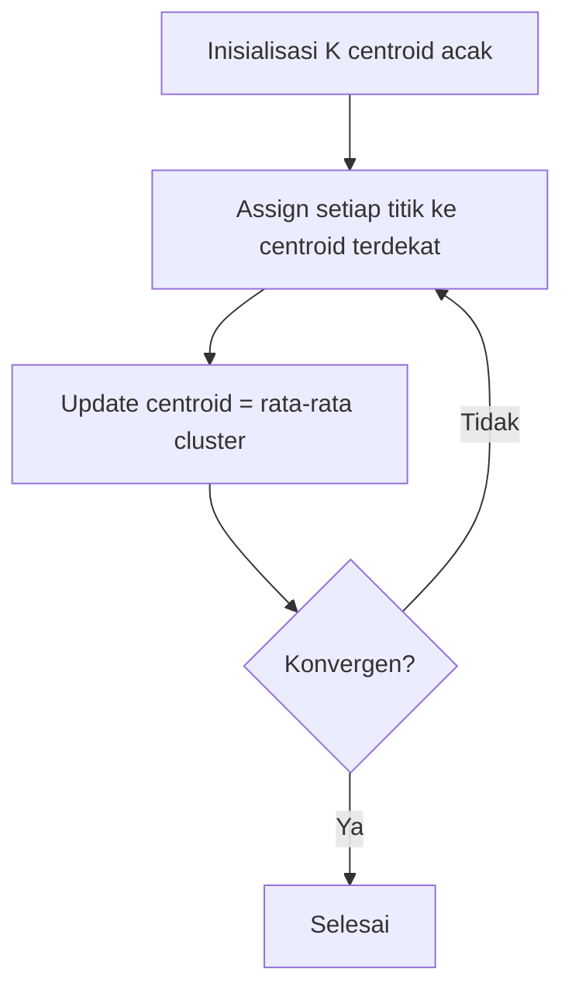

# Unsupervised Learning

Unsupervised learning menemukan pola tersembunyi dalam data tanpa label.

## Clustering — Pengelompokan Data

### K-Means



```python
from sklearn.cluster import KMeans
from sklearn.preprocessing import StandardScaler
import numpy as np

# Data siswa: [jam_belajar, nilai]
X = np.array([[2, 60], [3, 65], [8, 90], [9, 92], [5, 75], [4, 70]])

# Normalisasi
scaler = StandardScaler()
X_scaled = scaler.fit_transform(X)

# Clustering
kmeans = KMeans(n_clusters=3, random_state=42)
labels = kmeans.fit_predict(X_scaled)
print("Cluster:", labels)
```

### Memilih K — Elbow Method

```python
inertias = []
for k in range(1, 10):
    km = KMeans(n_clusters=k, random_state=42)
    km.fit(X_scaled)
    inertias.append(km.inertia_)

# Plot — cari "siku" di grafik
import matplotlib.pyplot as plt
plt.plot(range(1, 10), inertias, 'bo-')
plt.xlabel('K')
plt.ylabel('Inertia')
plt.title('Elbow Method')
```

## Dimensionality Reduction — PCA

PCA (Principal Component Analysis) mereduksi dimensi data sambil mempertahankan informasi maksimal.

$$\mathbf{Z} = \mathbf{X} \mathbf{W}$$

Di mana $\mathbf{W}$ adalah eigenvector dari covariance matrix.

```python
from sklearn.decomposition import PCA

# Reduksi dari 100 fitur ke 2 dimensi untuk visualisasi
pca = PCA(n_components=2)
X_2d = pca.fit_transform(X_high_dim)

print(f"Variance explained: {pca.explained_variance_ratio_.sum():.2%}")

# Visualisasi
plt.scatter(X_2d[:, 0], X_2d[:, 1], c=labels)
plt.xlabel('PC1')
plt.ylabel('PC2')
```

## Anomaly Detection

```python
from sklearn.ensemble import IsolationForest

# Deteksi transaksi mencurigakan
clf = IsolationForest(contamination=0.1, random_state=42)
predictions = clf.fit_predict(X)
# -1 = anomali, 1 = normal
```

## Latihan

Dataset: [Mall Customer Segmentation](https://www.kaggle.com/datasets/vjchoudhary7/customer-segmentation-tutorial-in-python)
1. Load data (Annual Income, Spending Score)
2. Tentukan K optimal dengan Elbow Method
3. Cluster pelanggan dan visualisasikan
4. Interpretasikan setiap cluster — siapa mereka?
