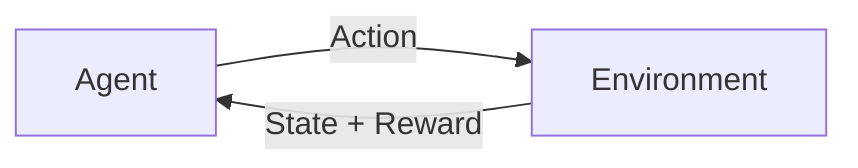

# Reinforcement Learning

RL adalah paradigma ML di mana agent belajar dari interaksi dengan lingkungan melalui reward dan punishment.

## Konsep Dasar



- **Agent** — yang belajar dan mengambil keputusan
- **Environment** — dunia tempat agent berinteraksi
- **State (s)** — kondisi lingkungan saat ini
- **Action (a)** — pilihan yang bisa diambil agent
- **Reward (r)** — sinyal feedback dari lingkungan
- **Policy (π)** — strategi agent: state → action

## Q-Learning

Q-Learning mempelajari nilai (Q-value) dari setiap pasangan state-action:

$$Q(s, a) \leftarrow Q(s, a) + \alpha \left[ r + \gamma \max_{a'} Q(s', a') - Q(s, a) \right]$$

- $\alpha$ = learning rate
- $\gamma$ = discount factor (nilai reward masa depan)

```python
import numpy as np
import gym

env = gym.make("FrozenLake-v1")
n_states = env.observation_space.n   # 16
n_actions = env.action_space.n       # 4

# Q-table: state × action
Q = np.zeros((n_states, n_actions))

alpha = 0.1   # learning rate
gamma = 0.99  # discount factor
epsilon = 1.0 # exploration rate

for episode in range(10000):
    state, _ = env.reset()
    done = False

    while not done:
        # Epsilon-greedy: eksplorasi vs eksploitasi
        if np.random.random() < epsilon:
            action = env.action_space.sample()  # eksplorasi
        else:
            action = np.argmax(Q[state])         # eksploitasi

        next_state, reward, done, _, _ = env.step(action)

        # Update Q-value
        Q[state, action] += alpha * (
            reward + gamma * np.max(Q[next_state]) - Q[state, action]
        )
        state = next_state

    epsilon = max(0.01, epsilon * 0.995)  # decay epsilon

print("Q-table trained!")
print(f"Win rate: {evaluate(Q, env):.2%}")
```

## Deep Q-Network (DQN)

Untuk state space yang besar, gunakan neural network sebagai Q-function:

```python
import torch
import torch.nn as nn

class DQN(nn.Module):
    def __init__(self, state_dim, action_dim):
        super().__init__()
        self.net = nn.Sequential(
            nn.Linear(state_dim, 128),
            nn.ReLU(),
            nn.Linear(128, 128),
            nn.ReLU(),
            nn.Linear(128, action_dim)
        )

    def forward(self, x):
        return self.net(x)
```

## Latihan

1. Install: `pip install gymnasium`
2. Solve `CartPole-v1` dengan Q-Learning
3. Visualisasikan reward per episode
4. Coba `LunarLander-v2` dengan DQN menggunakan library `stable-baselines3`
