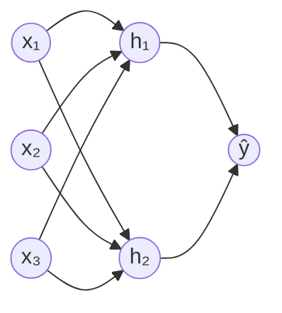

# Neural Network & Deep Learning

Neural network terinspirasi dari otak manusia — jaringan neuron buatan yang belajar dari data.

## Arsitektur Dasar



- **Input layer** — data mentah (pixel, angka, teks)
- **Hidden layers** — ekstraksi fitur
- **Output layer** — prediksi akhir

## Neuron Buatan

Setiap neuron melakukan:

$$z = \sum_{i} w_i x_i + b$$
$$a = \sigma(z)$$

Di mana $\sigma$ adalah **activation function**.

## Activation Functions

| Fungsi | Formula | Kegunaan |
|--------|---------|----------|
| ReLU | $\max(0, x)$ | Hidden layers (paling umum) |
| Sigmoid | $\frac{1}{1+e^{-x}}$ | Output biner |
| Softmax | $\frac{e^{x_i}}{\sum e^{x_j}}$ | Output multi-class |
| Tanh | $\frac{e^x - e^{-x}}{e^x + e^{-x}}$ | RNN |

## Backpropagation

Cara neural network belajar — hitung gradient loss terhadap setiap weight:

$$\frac{\partial L}{\partial w} = \frac{\partial L}{\partial a} \cdot \frac{\partial a}{\partial z} \cdot \frac{\partial z}{\partial w}$$

**Gradient Descent:**
$$w = w - \alpha \frac{\partial L}{\partial w}$$

Di mana $\alpha$ adalah **learning rate**.

## Implementasi dengan PyTorch

```python
import torch
import torch.nn as nn
import torch.optim as optim

# Definisi model
class SimpleNN(nn.Module):
    def __init__(self):
        super().__init__()
        self.layers = nn.Sequential(
            nn.Linear(784, 256),  # Input: 28x28 pixel
            nn.ReLU(),
            nn.Dropout(0.2),
            nn.Linear(256, 128),
            nn.ReLU(),
            nn.Linear(128, 10),   # Output: 10 kelas
        )

    def forward(self, x):
        return self.layers(x)

# Training loop
model = SimpleNN()
optimizer = optim.Adam(model.parameters(), lr=0.001)
criterion = nn.CrossEntropyLoss()

for epoch in range(10):
    for X_batch, y_batch in dataloader:
        optimizer.zero_grad()
        output = model(X_batch)
        loss = criterion(output, y_batch)
        loss.backward()
        optimizer.step()

    print(f"Epoch {epoch+1}, Loss: {loss.item():.4f}")
```

## Convolutional Neural Network (CNN)

Untuk data gambar:

```python
class CNN(nn.Module):
    def __init__(self):
        super().__init__()
        self.conv = nn.Sequential(
            nn.Conv2d(1, 32, kernel_size=3),  # 32 filter 3x3
            nn.ReLU(),
            nn.MaxPool2d(2),
            nn.Conv2d(32, 64, kernel_size=3),
            nn.ReLU(),
            nn.MaxPool2d(2),
        )
        self.fc = nn.Sequential(
            nn.Flatten(),
            nn.Linear(64 * 5 * 5, 128),
            nn.ReLU(),
            nn.Linear(128, 10),
        )

    def forward(self, x):
        return self.fc(self.conv(x))
```

## Latihan

1. Install PyTorch: `pip install torch torchvision`
2. Load dataset MNIST: `torchvision.datasets.MNIST`
3. Train model CNN sederhana
4. Evaluasi akurasi di test set — target > 98%
