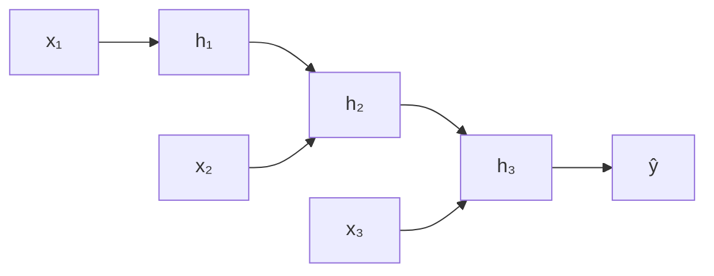

# Recurrent Neural Network & LSTM

RNN dirancang untuk data sekuensial — teks, time series, audio — di mana urutan sangat penting.

## Masalah Vanishing Gradient di RNN

RNN standar kesulitan belajar dependensi jangka panjang karena gradient menghilang saat backpropagation melalui banyak timestep.



$$h_t = \tanh(W_h h_{t-1} + W_x x_t + b)$$

## LSTM — Long Short-Term Memory

LSTM mengatasi vanishing gradient dengan mekanisme **gate**:

$$f_t = \sigma(W_f [h_{t-1}, x_t] + b_f) \quad \text{(forget gate)}$$
$$i_t = \sigma(W_i [h_{t-1}, x_t] + b_i) \quad \text{(input gate)}$$
$$o_t = \sigma(W_o [h_{t-1}, x_t] + b_o) \quad \text{(output gate)}$$
$$c_t = f_t \odot c_{t-1} + i_t \odot \tilde{c}_t \quad \text{(cell state)}$$

```python
import torch
import torch.nn as nn
import numpy as np

class LSTMPredictor(nn.Module):
    def __init__(self, input_size=1, hidden_size=64, num_layers=2):
        super().__init__()
        self.lstm = nn.LSTM(input_size, hidden_size, num_layers, batch_first=True)
        self.fc = nn.Linear(hidden_size, 1)

    def forward(self, x):
        out, _ = self.lstm(x)
        return self.fc(out[:, -1, :])

# Prediksi harga saham / suhu
# Data: sequence panjang 30 → prediksi nilai ke-31
model = LSTMPredictor()
criterion = nn.MSELoss()
optimizer = torch.optim.Adam(model.parameters(), lr=0.001)

for epoch in range(100):
    for X_batch, y_batch in dataloader:
        pred = model(X_batch)
        loss = criterion(pred, y_batch)
        optimizer.zero_grad()
        loss.backward()
        optimizer.step()
```

## Prediksi Time Series

```python
import pandas as pd
from sklearn.preprocessing import MinMaxScaler

# Load data suhu harian
df = pd.read_csv("suhu_yogyakarta.csv")
scaler = MinMaxScaler()
data = scaler.fit_transform(df[["suhu"]].values)

# Buat sequences
def create_sequences(data, seq_len=30):
    X, y = [], []
    for i in range(len(data) - seq_len):
        X.append(data[i:i+seq_len])
        y.append(data[i+seq_len])
    return np.array(X), np.array(y)

X, y = create_sequences(data)
# Train LSTM, prediksi suhu 7 hari ke depan
```

## Latihan

1. Download data cuaca Yogyakarta dari BMKG
2. Train LSTM untuk prediksi suhu 7 hari ke depan
3. Bandingkan dengan ARIMA (model statistik klasik)
4. Visualisasikan prediksi vs aktual
