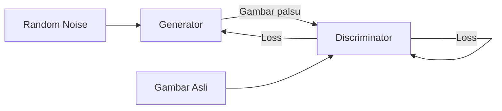

# Generative AI & Diffusion Models

Model generatif tidak hanya mengklasifikasi data — mereka menciptakan data baru yang realistis.

## GAN — Generative Adversarial Network



**Generator** belajar membuat gambar realistis.
**Discriminator** belajar membedakan asli vs palsu.
Keduanya saling bersaing — hasilnya gambar yang semakin realistis.

```python
import torch
import torch.nn as nn

class Generator(nn.Module):
    def __init__(self, latent_dim=100):
        super().__init__()
        self.model = nn.Sequential(
            nn.Linear(latent_dim, 256),
            nn.LeakyReLU(0.2),
            nn.Linear(256, 512),
            nn.LeakyReLU(0.2),
            nn.Linear(512, 784),  # 28x28
            nn.Tanh()
        )

    def forward(self, z):
        return self.model(z).view(-1, 1, 28, 28)

class Discriminator(nn.Module):
    def __init__(self):
        super().__init__()
        self.model = nn.Sequential(
            nn.Flatten(),
            nn.Linear(784, 512),
            nn.LeakyReLU(0.2),
            nn.Dropout(0.3),
            nn.Linear(512, 1),
            nn.Sigmoid()
        )

    def forward(self, img):
        return self.model(img)

# Training
G = Generator()
D = Discriminator()
optimizer_G = torch.optim.Adam(G.parameters(), lr=0.0002)
optimizer_D = torch.optim.Adam(D.parameters(), lr=0.0002)
criterion = nn.BCELoss()
```

## Diffusion Models — State of the Art

Diffusion model belajar dengan cara menambahkan noise secara bertahap, lalu belajar menghapus noise tersebut:

$$q(x_t | x_{t-1}) = \mathcal{N}(x_t; \sqrt{1-\beta_t} x_{t-1}, \beta_t \mathbf{I})$$

```python
from diffusers import StableDiffusionPipeline
import torch

# Load Stable Diffusion (perlu GPU dengan VRAM cukup)
pipe = StableDiffusionPipeline.from_pretrained(
    "runwayml/stable-diffusion-v1-5",
    torch_dtype=torch.float16
).to("cuda")

# Generate gambar dari teks
prompt = "Foto realistic siswa SMA sedang coding di lab komputer, cinematic, 4k"
negative_prompt = "blur, low quality, cartoon"

image = pipe(
    prompt,
    negative_prompt=negative_prompt,
    num_inference_steps=30,
    guidance_scale=7.5
).images[0]

image.save("generated.png")
```

## Menggunakan Stable Diffusion Lokal

```bash
# Install Automatic1111 WebUI (UI terpopuler)
git clone https://github.com/AUTOMATIC1111/stable-diffusion-webui
cd stable-diffusion-webui

# Download model dari HuggingFace
# Taruh di models/Stable-diffusion/

./webui.sh  # Linux/Mac
# Buka http://localhost:7860
```

## Fine-tuning dengan LoRA

```python
from diffusers import DiffusionPipeline
from peft import LoraConfig

# LoRA (Low-Rank Adaptation) — fine-tune dengan VRAM minimal
lora_config = LoraConfig(
    r=16,
    lora_alpha=32,
    target_modules=["to_q", "to_v"],
    lora_dropout=0.1,
)

# Train dengan ~20 gambar untuk gaya tertentu
```

## Latihan

1. Install Stable Diffusion WebUI lokal
2. Generate 10 gambar dengan berbagai prompt
3. Eksperimen dengan negative prompts dan CFG scale
4. Fine-tune dengan LoRA menggunakan foto dirimu (5-10 foto)
