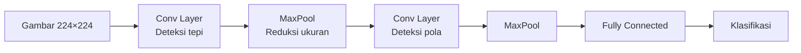

# Klasifikasi Gambar dengan CNN

Computer vision memungkinkan komputer memahami konten visual — dari foto kucing hingga deteksi kanker.

## Bagaimana CNN Bekerja



**Convolution** mengekstrak fitur lokal:
- Layer awal: tepi, warna
- Layer tengah: tekstur, bentuk
- Layer dalam: objek kompleks

## Transfer Learning

Jangan latih dari nol — gunakan model yang sudah dilatih di ImageNet (1.2 juta gambar):

```python
import torch
import torchvision.models as models
import torchvision.transforms as transforms
from torch import nn, optim
from torchvision.datasets import ImageFolder
from torch.utils.data import DataLoader

# Load pretrained ResNet50
model = models.resnet50(pretrained=True)

# Freeze semua layer kecuali layer terakhir
for param in model.parameters():
    param.requires_grad = False

# Ganti classifier untuk dataset kita (misal: 6 kelas track)
model.fc = nn.Sequential(
    nn.Linear(2048, 256),
    nn.ReLU(),
    nn.Dropout(0.3),
    nn.Linear(256, 6)  # 6 track
)

# Data augmentation
transform_train = transforms.Compose([
    transforms.RandomResizedCrop(224),
    transforms.RandomHorizontalFlip(),
    transforms.ColorJitter(brightness=0.2, contrast=0.2),
    transforms.ToTensor(),
    transforms.Normalize([0.485, 0.456, 0.406], [0.229, 0.224, 0.225])
])

transform_val = transforms.Compose([
    transforms.Resize(256),
    transforms.CenterCrop(224),
    transforms.ToTensor(),
    transforms.Normalize([0.485, 0.456, 0.406], [0.229, 0.224, 0.225])
])

# Dataset
train_data = ImageFolder("data/train", transform=transform_train)
val_data = ImageFolder("data/val", transform=transform_val)

train_loader = DataLoader(train_data, batch_size=32, shuffle=True)
val_loader = DataLoader(val_data, batch_size=32)

# Training
device = torch.device("cuda" if torch.cuda.is_available() else "cpu")
model = model.to(device)

criterion = nn.CrossEntropyLoss()
optimizer = optim.Adam(model.fc.parameters(), lr=0.001)

for epoch in range(10):
    model.train()
    for images, labels in train_loader:
        images, labels = images.to(device), labels.to(device)
        optimizer.zero_grad()
        outputs = model(images)
        loss = criterion(outputs, labels)
        loss.backward()
        optimizer.step()

    # Validasi
    model.eval()
    correct = 0
    with torch.no_grad():
        for images, labels in val_loader:
            images, labels = images.to(device), labels.to(device)
            outputs = model(images)
            correct += (outputs.argmax(1) == labels).sum().item()

    acc = correct / len(val_data)
    print(f"Epoch {epoch+1}: Accuracy = {acc:.2%}")
```

## Deteksi Objek dengan YOLO

```python
from ultralytics import YOLO

# Load model pretrained
model = YOLO("yolov8n.pt")

# Deteksi objek di gambar
results = model("foto.jpg")

for result in results:
    boxes = result.boxes
    for box in boxes:
        cls = result.names[int(box.cls)]
        conf = float(box.conf)
        print(f"{cls}: {conf:.2%}")

# Visualisasi
results[0].show()
```

## Latihan

1. Download dataset [Cats vs Dogs](https://www.kaggle.com/c/dogs-vs-cats)
2. Fine-tune MobileNetV3 (lebih ringan dari ResNet)
3. Target akurasi > 95%
4. Deploy sebagai web app sederhana dengan Gradio:

```python
import gradio as gr

def classify(image):
    # preprocessing + inference
    return {"kucing": 0.9, "anjing": 0.1}

gr.Interface(fn=classify, inputs="image", outputs="label").launch()
```
