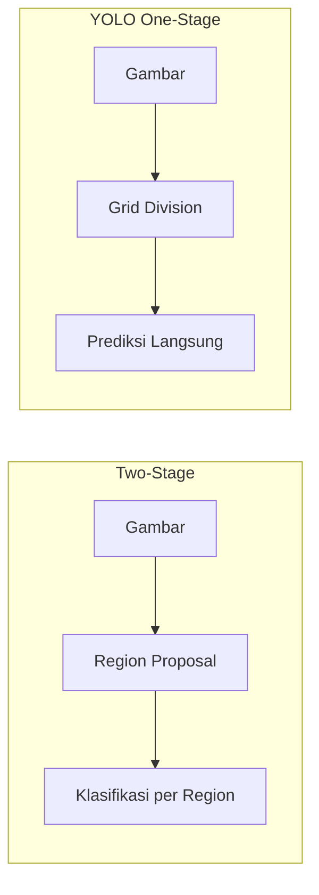

# Deteksi Objek dengan YOLO

YOLO (You Only Look Once) adalah algoritma deteksi objek real-time yang memproses seluruh gambar sekaligus.

## YOLO vs Two-Stage Detector



YOLO jauh lebih cepat (45+ FPS) karena hanya satu forward pass.

## Implementasi YOLOv8

```python
from ultralytics import YOLO
import cv2

# Load model
model = YOLO("yolov8n.pt")  # nano (tercepat), s, m, l, x (terbesar)

# Deteksi di gambar
results = model("foto_kelas.jpg", conf=0.5)

for result in results:
    # Bounding boxes
    for box in result.boxes:
        cls_name = result.names[int(box.cls)]
        confidence = float(box.conf)
        x1, y1, x2, y2 = map(int, box.xyxy[0])
        print(f"{cls_name}: {confidence:.2%} @ ({x1},{y1})-({x2},{y2})")

    # Simpan hasil
    result.save("hasil_deteksi.jpg")

# Real-time dari webcam
cap = cv2.VideoCapture(0)
while True:
    ret, frame = cap.read()
    results = model(frame, stream=True)
    for r in results:
        annotated = r.plot()
        cv2.imshow("YOLO Detection", annotated)
    if cv2.waitKey(1) & 0xFF == ord('q'):
        break
cap.release()
```

## Fine-tuning YOLO untuk Dataset Custom

```python
# 1. Siapkan dataset dalam format YOLO:
# dataset/
#   images/train/*.jpg
#   images/val/*.jpg
#   labels/train/*.txt  (class x_center y_center width height)
#   labels/val/*.txt

# 2. Buat data.yaml
import yaml
data = {
    "path": "dataset",
    "train": "images/train",
    "val": "images/val",
    "names": {0: "siswa", 1: "guru", 2: "papan_tulis"}
}
with open("data.yaml", "w") as f:
    yaml.dump(data, f)

# 3. Training
model = YOLO("yolov8n.pt")
results = model.train(
    data="data.yaml",
    epochs=50,
    imgsz=640,
    batch=16,
    device="cuda"  # atau "cpu"
)

# 4. Evaluasi
metrics = model.val()
print(f"mAP50: {metrics.box.map50:.3f}")
```

## Labeling Tool

```bash
# Label Studio — web-based annotation
pip install label-studio
label-studio start

# Roboflow — cloud-based, export ke YOLO format
# https://roboflow.com (gratis untuk dataset kecil)
```

## Latihan

1. Buat dataset 100 gambar dengan 2-3 kelas (misal: masker/tidak masker)
2. Label menggunakan Label Studio atau Roboflow
3. Fine-tune YOLOv8n
4. Deploy sebagai web app dengan Gradio atau Streamlit
