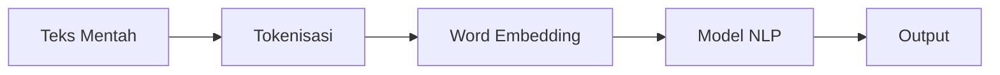
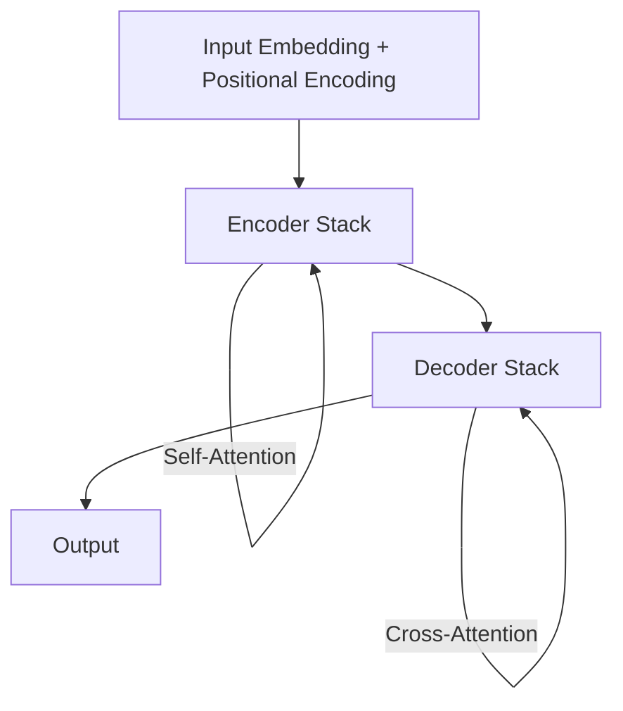

# NLP & Transformer

Natural Language Processing memungkinkan komputer memahami, menginterpretasi, dan menghasilkan bahasa manusia.

## Pipeline NLP



## Tokenisasi & Embedding

```python
from transformers import AutoTokenizer

tokenizer = AutoTokenizer.from_pretrained("bert-base-multilingual-cased")

teks = "Saya belajar AI di SMA UII Yogyakarta"
tokens = tokenizer(teks, return_tensors="pt")

print(tokens["input_ids"])
# tensor([[101, 1234, 5678, ...]])
```

**Word Embedding** — representasi kata sebagai vektor:

$$\text{king} - \text{man} + \text{woman} \approx \text{queen}$$

## Arsitektur Transformer



**Self-Attention:**
$$\text{Attention}(Q, K, V) = \text{softmax}\left(\frac{QK^T}{\sqrt{d_k}}\right)V$$

## Fine-tuning BERT untuk Klasifikasi Sentimen

```python
from transformers import AutoModelForSequenceClassification, Trainer, TrainingArguments
from datasets import load_dataset

# Load dataset
dataset = load_dataset("indonlu", "smsa")  # Sentimen Bahasa Indonesia

# Load model
model = AutoModelForSequenceClassification.from_pretrained(
    "indolem/indobert-base-uncased",
    num_labels=3  # positif, negatif, netral
)

# Training
training_args = TrainingArguments(
    output_dir="./results",
    num_train_epochs=3,
    per_device_train_batch_size=16,
    evaluation_strategy="epoch",
    save_strategy="epoch",
    load_best_model_at_end=True,
)

trainer = Trainer(
    model=model,
    args=training_args,
    train_dataset=dataset["train"],
    eval_dataset=dataset["validation"],
)

trainer.train()
```

## Menggunakan LLM via API

```python
from openai import OpenAI

client = OpenAI(api_key="sk-...")

# Chat completion
response = client.chat.completions.create(
    model="gpt-4o-mini",
    messages=[
        {"role": "system", "content": "Kamu adalah tutor AI untuk siswa SMA."},
        {"role": "user", "content": "Jelaskan apa itu gradient descent dengan analogi sederhana."}
    ]
)

print(response.choices[0].message.content)
```

## RAG — Retrieval Augmented Generation

```python
from langchain.vectorstores import Chroma
from langchain.embeddings import HuggingFaceEmbeddings
from langchain.chains import RetrievalQA
from langchain.llms import Ollama

# Embed dokumen
embeddings = HuggingFaceEmbeddings(model_name="sentence-transformers/all-MiniLM-L6-v2")
vectorstore = Chroma.from_documents(docs, embeddings)

# QA chain
llm = Ollama(model="llama3")
qa = RetrievalQA.from_chain_type(
    llm=llm,
    retriever=vectorstore.as_retriever(search_kwargs={"k": 3})
)

answer = qa.run("Apa syarat pendaftaran SMA UII?")
```

## Latihan

1. Gunakan HuggingFace pipeline untuk analisis sentimen review produk Indonesia
2. Fine-tune IndoBERT untuk klasifikasi topik berita (politik, olahraga, teknologi)
3. Buat chatbot sederhana menggunakan Ollama (local LLM) + LangChain
