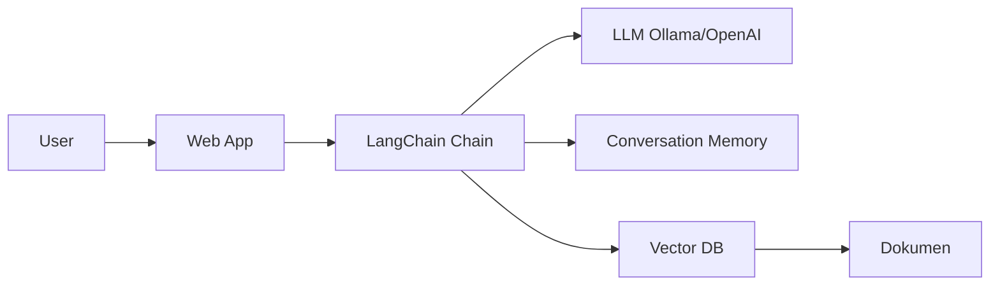

# Membangun Chatbot dengan LangChain

LangChain adalah framework untuk membangun aplikasi berbasis LLM — dari chatbot sederhana hingga agent yang bisa menggunakan tools.

## Arsitektur Chatbot



## Setup Ollama (Local LLM)

```bash
# Install Ollama
curl -fsSL https://ollama.ai/install.sh | sh

# Download model
ollama pull llama3.2
ollama pull nomic-embed-text  # untuk embedding

# Test
ollama run llama3.2 "Jelaskan apa itu machine learning"
```

## Chatbot Sederhana

```python
from langchain_ollama import ChatOllama
from langchain_core.messages import HumanMessage, SystemMessage
from langchain_core.chat_history import InMemoryChatMessageHistory
from langchain_core.runnables.history import RunnableWithMessageHistory

llm = ChatOllama(model="llama3.2", temperature=0.7)

# Memory per session
store = {}
def get_history(session_id: str):
    if session_id not in store:
        store[session_id] = InMemoryChatMessageHistory()
    return store[session_id]

chain = RunnableWithMessageHistory(llm, get_history)

# Chat
response = chain.invoke(
    [
        SystemMessage("Kamu adalah tutor AI untuk siswa SMA UII. Jawab dalam Bahasa Indonesia."),
        HumanMessage("Apa itu gradient descent?")
    ],
    config={"configurable": {"session_id": "user-123"}}
)
print(response.content)
```

## RAG — Chatbot dengan Dokumen

```python
from langchain_community.document_loaders import DirectoryLoader, TextLoader
from langchain.text_splitter import RecursiveCharacterTextSplitter
from langchain_community.vectorstores import Chroma
from langchain_ollama import OllamaEmbeddings
from langchain.chains import RetrievalQA

# 1. Load dokumen (materi LMS)
loader = DirectoryLoader("smauii-dev-content/tracks/", glob="**/*.md",
                          loader_cls=TextLoader)
docs = loader.load()

# 2. Split ke chunks
splitter = RecursiveCharacterTextSplitter(chunk_size=500, chunk_overlap=50)
chunks = splitter.split_documents(docs)

# 3. Embed dan simpan ke vector DB
embeddings = OllamaEmbeddings(model="nomic-embed-text")
vectorstore = Chroma.from_documents(chunks, embeddings, persist_directory="./chroma_db")

# 4. QA Chain
llm = ChatOllama(model="llama3.2")
qa_chain = RetrievalQA.from_chain_type(
    llm=llm,
    retriever=vectorstore.as_retriever(search_kwargs={"k": 3}),
    return_source_documents=True
)

# 5. Tanya
result = qa_chain.invoke("Bagaimana cara membuat branch di Git?")
print(result["result"])
print("\nSumber:", [doc.metadata["source"] for doc in result["source_documents"]])
```

## Web Interface dengan Streamlit

```python
import streamlit as st

st.title("🤖 Tutor AI SMA UII")

if "messages" not in st.session_state:
    st.session_state.messages = []

for msg in st.session_state.messages:
    with st.chat_message(msg["role"]):
        st.write(msg["content"])

if prompt := st.chat_input("Tanya sesuatu tentang materi..."):
    st.session_state.messages.append({"role": "user", "content": prompt})
    with st.chat_message("user"):
        st.write(prompt)

    with st.chat_message("assistant"):
        with st.spinner("Berpikir..."):
            response = qa_chain.invoke(prompt)
            answer = response["result"]
        st.write(answer)
        st.session_state.messages.append({"role": "assistant", "content": answer})
```

## Latihan

1. Setup Ollama dengan model llama3.2
2. Buat chatbot yang bisa menjawab pertanyaan tentang materi LMS ini
3. Tambah fitur: tampilkan sumber dokumen yang digunakan
4. Deploy ke Streamlit Cloud
