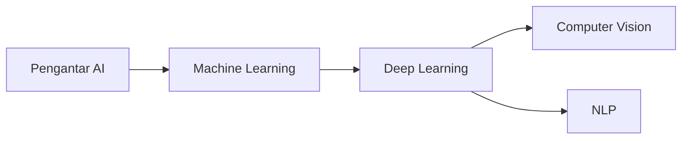

# AI (Kecerdasan Buatan)

Track ini mempersiapkan kamu untuk memahami dan membangun sistem AI — dari teori matematika hingga implementasi nyata.

## Roadmap

## Modul

1. **Pengantar AI** — Sejarah, konsep, dan aplikasi AI
2. **Machine Learning** — Supervised, unsupervised, reinforcement learning
3. **Deep Learning** — Neural network, backpropagation, CNN, RNN
4. **Computer Vision** — Deteksi objek, klasifikasi gambar
5. **NLP** — Pemrosesan bahasa alami, transformer, LLM

## Prasyarat

- Matematika dasar (aljabar linear, kalkulus, statistik)
- Python dasar
