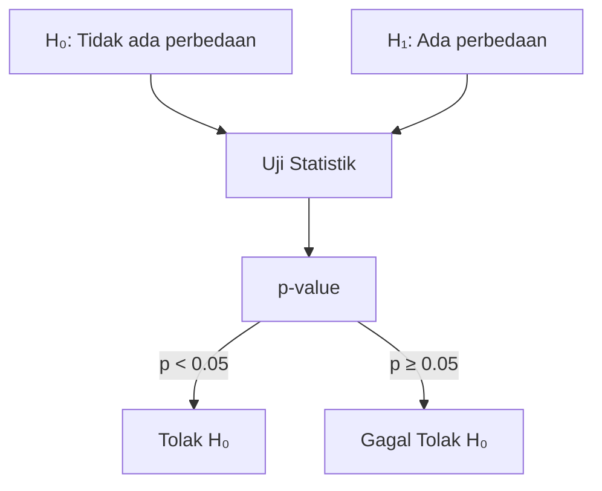

# Statistik untuk Data Science

Statistik adalah bahasa data — tanpa memahaminya, kamu hanya menebak-nebak.

## Statistik Deskriptif

### Ukuran Pemusatan

$$\text{Mean} = \bar{x} = \frac{\sum x_i}{n}$$

$$\text{Median} = \text{nilai tengah setelah diurutkan}$$

$$\text{Mode} = \text{nilai yang paling sering muncul}$$

```python
import numpy as np
from scipy import stats

data = [72, 85, 90, 68, 75, 85, 92, 78, 85, 70]

print(f"Mean:   {np.mean(data):.1f}")
print(f"Median: {np.median(data):.1f}")
print(f"Mode:   {stats.mode(data).mode}")
```

### Ukuran Penyebaran

$$\text{Variance} = s^2 = \frac{\sum (x_i - \bar{x})^2}{n-1}$$

$$\text{Std Dev} = s = \sqrt{s^2}$$

$$\text{IQR} = Q_3 - Q_1$$

```python
print(f"Std Dev: {np.std(data, ddof=1):.2f}")
print(f"Variance: {np.var(data, ddof=1):.2f}")
print(f"IQR: {np.percentile(data, 75) - np.percentile(data, 25):.1f}")
```

## Distribusi Probabilitas

### Normal Distribution

$$f(x) = \frac{1}{\sigma\sqrt{2\pi}} e^{-\frac{(x-\mu)^2}{2\sigma^2}}$$

```python
import matplotlib.pyplot as plt
from scipy.stats import norm

x = np.linspace(-4, 4, 100)
plt.plot(x, norm.pdf(x, 0, 1))
plt.title("Distribusi Normal Standar")
plt.xlabel("z-score")
plt.ylabel("Probabilitas")
```

**Aturan 68-95-99.7:**
- 68% data dalam $\mu \pm 1\sigma$
- 95% data dalam $\mu \pm 2\sigma$
- 99.7% data dalam $\mu \pm 3\sigma$

## Korelasi

$$r = \frac{\sum (x_i - \bar{x})(y_i - \bar{y})}{\sqrt{\sum(x_i-\bar{x})^2 \sum(y_i-\bar{y})^2}}$$

- $r = 1$ — korelasi positif sempurna
- $r = 0$ — tidak ada korelasi linear
- $r = -1$ — korelasi negatif sempurna

> **Ingat:** Korelasi ≠ Kausalitas!

```python
import pandas as pd

df = pd.DataFrame({
    "jam_belajar": [1, 2, 3, 4, 5, 6, 7, 8],
    "nilai": [40, 50, 55, 65, 70, 75, 85, 90]
})

print(df.corr())
```

## Hypothesis Testing



```python
from scipy.stats import ttest_ind

# Apakah nilai siswa yang ikut kursus lebih tinggi?
kursus = [85, 90, 78, 92, 88, 95]
tanpa_kursus = [70, 65, 72, 68, 75, 71]

t_stat, p_value = ttest_ind(kursus, tanpa_kursus)
print(f"t-statistic: {t_stat:.3f}")
print(f"p-value: {p_value:.4f}")
print("Signifikan!" if p_value < 0.05 else "Tidak signifikan")
```

## Latihan

Dataset nilai 30 siswa:
1. Hitung mean, median, std dev
2. Plot histogram distribusi nilai
3. Apakah distribusinya normal? (gunakan Shapiro-Wilk test)
4. Bandingkan nilai siswa IPA vs IPS — apakah berbeda signifikan?
