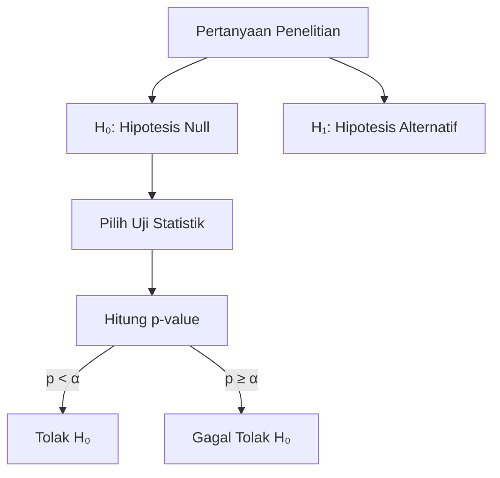

# Uji Hipotesis & A/B Testing

Uji hipotesis memungkinkan kita membuat keputusan berbasis data dengan tingkat kepercayaan yang terukur.

## Framework Uji Hipotesis



**α (significance level)** biasanya 0.05 — toleransi 5% salah menolak H₀.

## Jenis Uji Statistik

| Situasi | Uji |
|---------|-----|
| 2 grup, data normal | t-test |
| 2 grup, data tidak normal | Mann-Whitney U |
| 3+ grup | ANOVA |
| Proporsi | Chi-square |
| Sebelum-sesudah | Paired t-test |

## t-test

```python
from scipy import stats
import numpy as np

# Apakah metode belajar baru meningkatkan nilai?
sebelum = [72, 68, 75, 70, 65, 78, 71, 69]
sesudah = [80, 75, 82, 78, 72, 85, 79, 76]

# Paired t-test (sampel yang sama, dua kondisi)
t_stat, p_value = stats.ttest_rel(sesudah, sebelum)
print(f"t = {t_stat:.3f}, p = {p_value:.4f}")
print("Signifikan!" if p_value < 0.05 else "Tidak signifikan")

# Effect size (Cohen's d)
d = (np.mean(sesudah) - np.mean(sebelum)) / np.std(sebelum)
print(f"Effect size (d): {d:.2f}")
# d < 0.2: kecil, 0.2-0.8: sedang, > 0.8: besar
```

## ANOVA — Bandingkan 3+ Grup

```python
# Apakah nilai berbeda antar jurusan?
ipa = [85, 88, 90, 82, 87]
ips = [75, 78, 72, 80, 76]
bahasa = [80, 83, 78, 85, 81]

f_stat, p_value = stats.f_oneway(ipa, ips, bahasa)
print(f"F = {f_stat:.3f}, p = {p_value:.4f}")

# Post-hoc test (jika ANOVA signifikan)
from statsmodels.stats.multicomp import pairwise_tukeyhsd
import pandas as pd

data = ipa + ips + bahasa
groups = ["IPA"]*5 + ["IPS"]*5 + ["Bahasa"]*5
result = pairwise_tukeyhsd(data, groups)
print(result)
```

## Chi-Square — Variabel Kategorikal

```python
# Apakah kelulusan bergantung pada jurusan?
# Observed frequencies
observed = np.array([
    [45, 5],   # IPA: lulus, tidak lulus
    [38, 12],  # IPS: lulus, tidak lulus
    [40, 10],  # Bahasa: lulus, tidak lulus
])

chi2, p_value, dof, expected = stats.chi2_contingency(observed)
print(f"χ² = {chi2:.3f}, p = {p_value:.4f}, df = {dof}")
```

## A/B Testing

```python
# Apakah desain tombol baru meningkatkan klik?
# Grup A (kontrol): 1000 user, 120 klik
# Grup B (treatment): 1000 user, 150 klik

from statsmodels.stats.proportion import proportions_ztest

counts = np.array([150, 120])  # klik
nobs = np.array([1000, 1000])  # total user

z_stat, p_value = proportions_ztest(counts, nobs)
print(f"z = {z_stat:.3f}, p = {p_value:.4f}")

# Hitung sample size yang dibutuhkan
from statsmodels.stats.power import NormalIndPower

analysis = NormalIndPower()
n = analysis.solve_power(
    effect_size=0.1,  # perbedaan yang ingin dideteksi
    alpha=0.05,
    power=0.8
)
print(f"Sample size per grup: {int(n)}")
```

## Latihan

1. Dataset: nilai siswa sebelum dan sesudah program bimbel
2. Uji apakah bimbel signifikan meningkatkan nilai (paired t-test)
3. Bandingkan efektivitas 3 metode mengajar berbeda (ANOVA)
4. Desain A/B test untuk fitur baru di website sekolah
