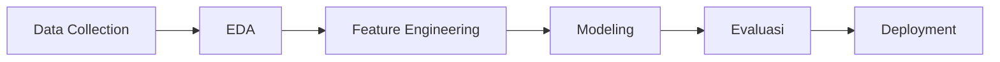

# Proyek End-to-End: Prediksi Kelulusan Siswa

Membangun model ML lengkap — dari data collection hingga deployment sebagai web app.

## Alur Proyek



## 1. Load & Eksplorasi Data

```python
import pandas as pd
import numpy as np
import matplotlib.pyplot as plt
import seaborn as sns
from sklearn.model_selection import train_test_split, cross_val_score
from sklearn.preprocessing import LabelEncoder, StandardScaler
from sklearn.ensemble import RandomForestClassifier, GradientBoostingClassifier
from sklearn.metrics import classification_report, confusion_matrix
import joblib

# Load data
df = pd.read_csv("data_siswa.csv")
print(df.head())
print(df.info())
print(df.describe())

# Target distribution
print(df["lulus"].value_counts(normalize=True))
```

## 2. Feature Engineering

```python
# Encode categorical
le = LabelEncoder()
df["kelas_enc"] = le.fit_transform(df["kelas"])
df["jurusan_enc"] = le.fit_transform(df["jurusan"])

# Buat fitur baru
df["rata_nilai"] = df[["mtk", "ipa", "ips", "bhs"]].mean(axis=1)
df["konsistensi"] = df[["mtk", "ipa", "ips", "bhs"]].std(axis=1)
df["absensi_pct"] = df["absensi"] / df["total_hari"] * 100

# Pilih fitur
features = ["rata_nilai", "konsistensi", "absensi_pct",
            "kelas_enc", "jurusan_enc", "ekstrakurikuler"]
X = df[features]
y = df["lulus"]

# Split
X_train, X_test, y_train, y_test = train_test_split(
    X, y, test_size=0.2, random_state=42, stratify=y
)

# Scale
scaler = StandardScaler()
X_train_scaled = scaler.fit_transform(X_train)
X_test_scaled = scaler.transform(X_test)
```

## 3. Modeling & Evaluasi

```python
models = {
    "Random Forest": RandomForestClassifier(n_estimators=100, random_state=42),
    "Gradient Boosting": GradientBoostingClassifier(random_state=42),
}

results = {}
for name, model in models.items():
    # Cross-validation
    cv_scores = cross_val_score(model, X_train_scaled, y_train, cv=5, scoring="f1")
    model.fit(X_train_scaled, y_train)
    y_pred = model.predict(X_test_scaled)

    results[name] = {
        "cv_mean": cv_scores.mean(),
        "cv_std": cv_scores.std(),
        "test_report": classification_report(y_test, y_pred)
    }
    print(f"\n{name}:")
    print(f"CV F1: {cv_scores.mean():.3f} ± {cv_scores.std():.3f}")
    print(results[name]["test_report"])

# Feature importance
best_model = models["Random Forest"]
importances = pd.Series(best_model.feature_importances_, index=features)
importances.sort_values().plot(kind="barh")
plt.title("Feature Importance")
```

## 4. Simpan Model

```python
joblib.dump(best_model, "model_kelulusan.pkl")
joblib.dump(scaler, "scaler.pkl")
```

## 5. Deploy dengan Streamlit

```python
# app.py
import streamlit as st
import joblib
import numpy as np

model = joblib.load("model_kelulusan.pkl")
scaler = joblib.load("scaler.pkl")

st.title("🎓 Prediksi Kelulusan Siswa")
st.write("Masukkan data siswa untuk memprediksi kemungkinan kelulusan.")

col1, col2 = st.columns(2)
with col1:
    rata_nilai = st.slider("Rata-rata Nilai", 0, 100, 75)
    absensi_pct = st.slider("Persentase Absensi (%)", 0, 100, 10)
with col2:
    konsistensi = st.slider("Konsistensi Nilai (Std Dev)", 0, 30, 10)
    ekskul = st.selectbox("Aktif Ekstrakurikuler?", [0, 1])

if st.button("Prediksi"):
    X = scaler.transform([[rata_nilai, konsistensi, absensi_pct, 0, 0, ekskul]])
    pred = model.predict(X)[0]
    prob = model.predict_proba(X)[0]

    if pred == 1:
        st.success(f"✅ Diprediksi LULUS dengan probabilitas {prob[1]:.1%}")
    else:
        st.error(f"❌ Diprediksi TIDAK LULUS dengan probabilitas {prob[0]:.1%}")

    st.bar_chart({"Tidak Lulus": prob[0], "Lulus": prob[1]})
```

```bash
streamlit run app.py
```

## Latihan

Kembangkan proyek ini:
1. Tambah fitur: nilai per semester (time series)
2. Coba XGBoost dan LightGBM
3. Hyperparameter tuning dengan GridSearchCV
4. Deploy ke Streamlit Cloud (gratis)
5. Buat laporan analisis dalam Jupyter Notebook
