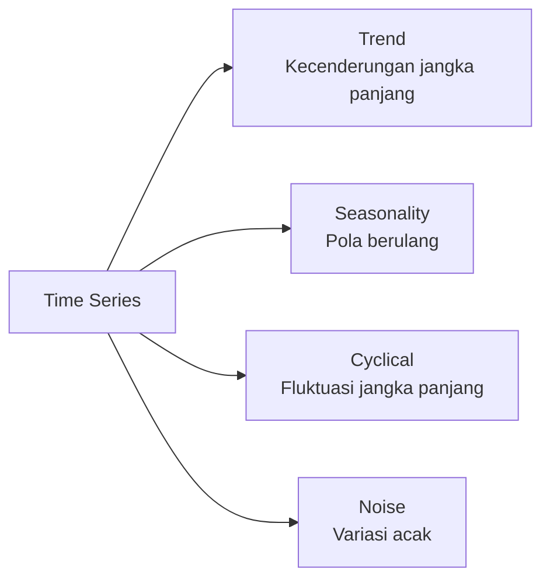

# Time Series Analysis

Data time series — data yang berurutan berdasarkan waktu — ada di mana-mana: harga saham, cuaca, traffic website, nilai semester.

## Komponen Time Series



## Eksplorasi Time Series

```python
import pandas as pd
import numpy as np
import matplotlib.pyplot as plt
from statsmodels.tsa.seasonal import seasonal_decompose

# Load data nilai semester
df = pd.read_csv("nilai_semester.csv", parse_dates=["tanggal"], index_col="tanggal")
df = df.resample("M").mean()  # Resample ke bulanan

# Decompose
result = seasonal_decompose(df["nilai"], model="additive", period=12)
result.plot()
plt.suptitle("Dekomposisi Time Series Nilai Siswa")
plt.tight_layout()
```

## ARIMA

ARIMA (AutoRegressive Integrated Moving Average) adalah model statistik klasik untuk forecasting:

$$y_t = c + \phi_1 y_{t-1} + \ldots + \phi_p y_{t-p} + \theta_1 \epsilon_{t-1} + \ldots + \theta_q \epsilon_{t-q} + \epsilon_t$$

```python
from statsmodels.tsa.arima.model import ARIMA
from statsmodels.tsa.stattools import adfuller

# Cek stationarity
result = adfuller(df["nilai"])
print(f"ADF Statistic: {result[0]:.4f}")
print(f"p-value: {result[1]:.4f}")

# Diferensiasi jika tidak stasioner
if result[1] > 0.05:
    df["nilai_diff"] = df["nilai"].diff()

# Fit ARIMA(p,d,q) — cari parameter optimal dengan auto_arima
from pmdarima import auto_arima
model = auto_arima(df["nilai"], seasonal=True, m=12,
                   information_criterion="aic", trace=True)
print(model.summary())

# Forecast 6 bulan ke depan
forecast = model.predict(n_periods=6)
```

## Prophet — Facebook's Forecasting

```python
from prophet import Prophet
import pandas as pd

# Prophet butuh kolom 'ds' (date) dan 'y' (value)
df_prophet = df.reset_index().rename(columns={"tanggal": "ds", "nilai": "y"})

model = Prophet(
    yearly_seasonality=True,
    weekly_seasonality=False,
    daily_seasonality=False,
    changepoint_prior_scale=0.05,  # Fleksibilitas trend
)

# Tambah holiday (libur semester)
model.add_country_holidays(country_name="ID")

model.fit(df_prophet)

# Forecast
future = model.make_future_dataframe(periods=180)  # 6 bulan
forecast = model.predict(future)
model.plot(forecast)
model.plot_components(forecast)
```

## Anomaly Detection

```python
from sklearn.ensemble import IsolationForest

# Deteksi nilai yang sangat tidak biasa
model = IsolationForest(contamination=0.05, random_state=42)
df["anomaly"] = model.fit_predict(df[["nilai"]])

# Plot anomalies
anomalies = df[df["anomaly"] == -1]
plt.plot(df.index, df["nilai"], label="Normal")
plt.scatter(anomalies.index, anomalies["nilai"],
            color="red", label="Anomali", zorder=5)
plt.legend()
```

## Latihan

1. Download data cuaca BMKG Yogyakarta (suhu harian 2020-2024)
2. Decompose time series — identifikasi trend dan seasonality
3. Forecast suhu 30 hari ke depan dengan Prophet
4. Bandingkan ARIMA vs Prophet — mana lebih akurat?
