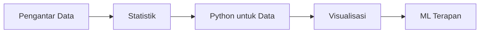

# Data Science

Track ini mengajarkan cara mengolah data menjadi keputusan yang lebih baik.

## Roadmap

## Modul

1. **Pengantar Data** — Data lifecycle, tipe data, tools
2. **Statistik** — Deskriptif, inferensial, distribusi
3. **Python untuk Data** — NumPy, Pandas, data wrangling
4. **Visualisasi** — Matplotlib, Seaborn, storytelling dengan data
5. **ML Terapan** — Kaggle, proyek end-to-end

## Prasyarat

- Python dasar
- Matematika SMA (statistik dasar)
