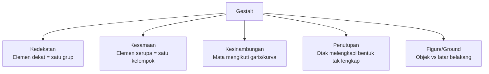

# Prinsip Desain Visual

Desain yang baik bukan kebetulan — ada prinsip-prinsip yang bisa dipelajari dan diterapkan secara konsisten.

## Mengapa Prinsip Ini Penting?

Ketika kamu melihat antarmuka dan langsung tahu harus klik apa, itu bukan keajaiban. Itu hasil designer yang menerapkan prinsip dengan benar. Sebaliknya, antarmuka yang membingungkan adalah hasil prinsip yang diabaikan.

## Prinsip Gestalt

Otak manusia secara otomatis mencari pola dan keteraturan. Gestalt menjelaskan bagaimana kita mempersepsi visual:



**Contoh penerapan proximity:**
- Item navigasi yang berdekatan → terasa seperti satu grup menu
- Label form yang dekat dengan input-nya → mudah dipahami

## Hierarki Visual

Hierarki mengarahkan mata pengguna ke informasi yang paling penting terlebih dahulu.

```
Ukuran:    BESAR > sedang > kecil
Warna:     #000000 > #666666 > #cccccc
Berat:     Bold > Regular > Light
Kontras:   Tinggi > Rendah
Posisi:    Atas-kiri > Kanan-bawah (untuk bahasa kiri-ke-kanan)
```

**Aturan praktis:** Tutup mata, buka, dan lihat apa yang pertama kali kamu perhatikan. Itulah elemen dengan hierarki tertinggi.

## Whitespace (Ruang Kosong)

Whitespace bukan "ruang yang terbuang" — ini adalah alat desain yang powerful.

| Tanpa whitespace | Dengan whitespace |
|-----------------|-------------------|
| Terasa sesak dan padat | Terasa bernapas dan elegan |
| Sulit dibaca | Mudah dibaca |
| Semua terasa sama pentingnya | Ada hierarki yang jelas |

> **Aturan spacing yang konsisten:** Gunakan kelipatan 8px — 8, 16, 24, 32, 48, 64px. Ini menciptakan ritme visual yang harmonis.

## Alignment

Elemen yang sejajar menciptakan keteraturan dan kepercayaan.

```
❌ Buruk — alignment acak:
  [Judul]
      [Paragraf pertama...]
    [Paragraf kedua...]
         [Tombol]

✅ Baik — left-aligned konsisten:
[Judul]
[Paragraf pertama...]
[Paragraf kedua...]
[Tombol]
```

**Aturan:** Pilih satu jenis alignment (biasanya kiri untuk body text) dan terapkan konsisten.

## Kontras & Aksesibilitas

WCAG (Web Content Accessibility Guidelines) menetapkan rasio kontras minimum:

| Teks | Rasio minimum |
|------|--------------|
| Teks normal (< 18px) | 4.5:1 |
| Teks besar (≥ 18px bold) | 3:1 |
| UI components | 3:1 |

Tools cek kontras:
- [coolors.co/contrast-checker](https://coolors.co/contrast-checker)
- Plugin Figma: "Contrast" atau "A11y - Color Contrast Checker"

## Rangkuman

- **Proximity** — elemen dekat dianggap satu grup
- **Hierarchy** — bimbing mata ke informasi terpenting
- **Whitespace** — bukan kosong, tapi alat desain
- **Alignment** — keteraturan membangun kepercayaan
- **Kontras** — inklusivitas bukan opsional

## Latihan

Ambil 3 aplikasi yang sering kamu pakai (Instagram, Tokopedia, dll):
1. Screenshot satu halaman dari masing-masing
2. Tandai: elemen apa yang paling menonjol? Mengapa?
3. Cek rasio kontras teks utama dengan tools di atas
4. Catat 1 hal yang menurutmu bisa diperbaiki dari setiap UI
