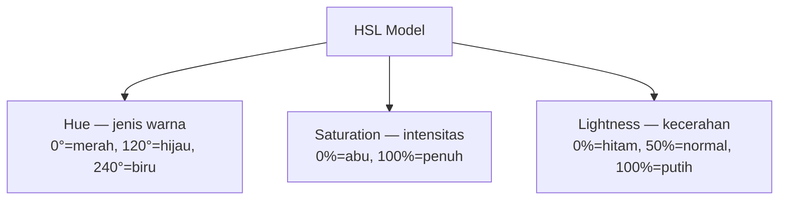

# Tipografi & Warna

Dua elemen ini membentuk 80% dari kesan pertama sebuah desain. Salah pilih font atau warna — seluruh mood berubah.

## Tipografi

### Anatomi Font

```
Baseline  → garis tempat huruf berdiri
Cap height → tinggi huruf kapital
x-height  → tinggi huruf kecil 'x'
Ascender  → bagian huruf di atas x-height (b, d, h)
Descender → bagian huruf di bawah baseline (g, p, y)
```

### Klasifikasi Font

| Jenis | Karakteristik | Cocok untuk |
|-------|--------------|-------------|
| Serif | Ada kaki di ujung huruf | Body text, editorial, kesan formal |
| Sans-serif | Tanpa kaki | UI digital, headline modern |
| Monospace | Lebar sama tiap karakter | Kode, terminal |
| Display | Dekoratif | Headline, branding — jangan untuk body |

**Rekomendasi pasangan font:**
- Heading: **Inter Bold** + Body: **Inter Regular** (aman, konsisten)
- Heading: **Playfair Display** + Body: **Lato** (elegan, kontras)
- Heading: **Space Grotesk** + Body: **DM Sans** (modern, tech)

### Type Scale

Jangan pilih ukuran font secara acak. Gunakan skala:

```
Display:  48–72px  → Hero section
H1:       36–48px  → Judul halaman
H2:       24–32px  → Judul seksi
H3:       18–24px  → Sub-judul
Body:     14–16px  → Konten utama
Small:    12px      → Label, caption
```

> **Aturan line-height:** Untuk body text, gunakan 1.5× ukuran font. Untuk heading, 1.2×.

## Teori Warna

### Model Warna



HSL lebih intuitif dari HEX untuk designer — kamu bisa "tune" warna secara natural.

### Palet Warna

**Primary** — warna brand utama, untuk aksi penting (tombol CTA, link)

**Secondary** — warna pendukung, untuk elemen sekunder

**Neutral** — abu-abu untuk teks, background, border. Butuh minimal 8 shade:
```
50:  #f9fafb  (background paling terang)
100: #f3f4f6
200: #e5e7eb
300: #d1d5db
400: #9ca3af
500: #6b7280  (tengah)
600: #4b5563
700: #374151
800: #1f2937
900: #111827  (paling gelap)
```

**Semantic** — warna dengan makna:
- Hijau → sukses, positif
- Merah → error, bahaya
- Kuning/oranye → warning
- Biru → info, link

### Harmony Warna

```
Monokromatik: satu hue, variasi saturation/lightness
Analogous:    3 warna berdekatan di color wheel (harmonis)
Complementary: 2 warna berlawanan (kontras tinggi)
Triadic:      3 warna dengan jarak 120° (vibrant)
```

## Warna di Dark Mode

```
Light mode:
  Background: white (#ffffff)
  Surface:    gray-50 (#f9fafb)
  Text:       gray-900 (#111827)

Dark mode — JANGAN hanya invert:
  Background: gray-950 (#030712)  ← hampir hitam, bukan hitam murni
  Surface:    gray-900 (#111827)
  Text:       gray-100 (#f3f4f6)  ← hampir putih, bukan putih murni
```

Mata manusia lebih nyaman dengan abu gelap daripada hitam murni di dark mode.

## Latihan

1. Buka [typ.io](https://typ.io) — temukan 3 pasangan font yang kamu suka
2. Buat palet warna untuk "Digital Lab SMA UII" di [coolors.co](https://coolors.co)
   - 1 primary color (cerminkan teknologi/inovasi)
   - Buat 9 shade neutral
3. Cek apakah palet kamu accessible dengan contrast checker
