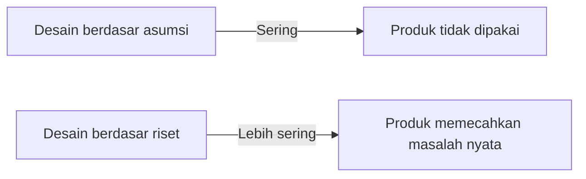

# User Interview & Persona

"Kamu bukan pengguna produkmu." — Quote ini wajib ditempel di meja setiap designer.

## Mengapa Riset Pengguna?



**Contoh nyata:** Tim yang membangun fitur "auto-save" karena _mereka_ sering lupa save, ternyata pengguna jarang kehilangan data — masalah utama pengguna adalah fitur _export_ yang lambat.

## User Interview

### Pertanyaan yang Baik vs Buruk

| ❌ Buruk | ✅ Baik |
|---------|--------|
| "Apakah kamu suka fitur ini?" | "Ceritakan terakhir kali kamu menggunakan fitur ini." |
| "Menurut kamu fitur apa yang dibutuhkan?" | "Apa yang paling frustasi saat menggunakan aplikasi ini?" |
| "Apakah kamu akan pakai ini setiap hari?" | "Seberapa sering kamu menghadapi masalah X?" |

**Prinsip:** Tanya tentang masa lalu (perilaku nyata), bukan masa depan (niat yang sering tidak akurat).

### Panduan Wawancara

```
Pembukaan (5 menit):
  - Perkenalan, jelaskan tujuan
  - "Tidak ada jawaban benar atau salah"
  - Minta izin rekam

Eksplorasi (20-30 menit):
  - Mulai dengan pertanyaan terbuka: "Ceritakan tentang rutinitas belajarmu"
  - Follow-up dengan "Mengapa?", "Bagaimana rasanya?", "Bisa ceritakan lebih?"
  - Diam sejenak — pengguna sering melanjutkan dengan insight berharga

Penutup (5 menit):
  - "Ada hal lain yang ingin kamu sampaikan?"
  - Terima kasih, jelaskan langkah selanjutnya
```

### Berapa Banyak Interview?

5 pengguna sudah cukup menemukan 85% masalah (Nielsen Norman Group). Mulai dari 5, iterasi jika perlu.

## Empathy Map

Setelah interview, rangkum temuan dalam empathy map:

```
┌─────────────────────────────────────┐
│              PENGGUNA               │
├──────────────┬──────────────────────┤
│    SAYS      │        THINKS        │
│ (kata-kata   │  (pikiran tersembunyi│
│  langsung)   │   yang tidak diucap) │
├──────────────┼──────────────────────┤
│     DOES     │        FEELS         │
│ (tindakan    │  (emosi yang muncul  │
│  yang diamati│   saat menggunakan)  │
└──────────────┴──────────────────────┘
         PAINS | GAINS
```

## User Persona

Persona adalah representasi fiktif tapi berbasis data dari pengguna tipikal:

```markdown
## Persona: Sandi, Siswa XII IPA

**Demografi:**
- Usia: 17 tahun, Yogyakarta
- Sekolah: SMA UII
- Perangkat: HP Android mid-range, laptop sekolah

**Goals:**
- Belajar programming untuk masuk jurusan Informatika
- Membangun portofolio sebelum lulus

**Frustrations:**
- Tutorial di YouTube terlalu lama dan bertele-tele
- Tidak tahu harus mulai dari mana
- Malu bertanya karena takut terlihat bodoh

**Behavior:**
- Belajar malam setelah pulang sekolah (21:00-23:00)
- Sering switch antara YouTube, Stack Overflow, dan ChatGPT
- Lebih suka belajar dengan proyek nyata daripada teori
```

## Latihan

1. Lakukan 3 user interview dengan teman sekelas tentang aplikasi belajar yang mereka gunakan
2. Buat empathy map dari hasil interview
3. Buat 1 persona berdasarkan pola yang muncul dari ketiga interview
4. Identifikasi: masalah utama apa yang perlu dipecahkan?
