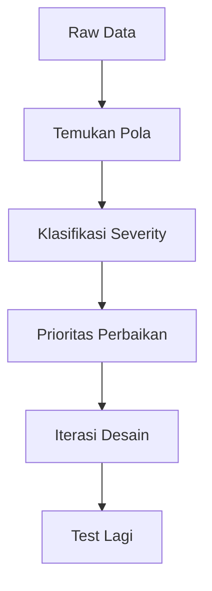

# Usability Testing

Desain yang menurutmu intuitif belum tentu intuitif bagi pengguna. Usability testing membuktikannya — atau menyangkalnya.

## Apa itu Usability Testing?

Mengamati pengguna nyata saat mencoba menyelesaikan tugas dengan produkmu. Bukan menanyakan pendapat — tapi mengamati perilaku.

> "Jangan tanya apa yang mereka suka. Lihat apa yang mereka lakukan."

## Think-Aloud Protocol

Minta pengguna berbicara keras-keras saat menggunakan produk:

```
Fasilitator: "Coba daftar akun baru di aplikasi ini. 
              Sambil melakukan itu, ceritakan apa yang 
              kamu pikirkan dan rasakan."

Pengguna:    "Oke, saya lihat ada tombol 'Mulai'... 
              saya klik... oh ada form... hmm, kenapa 
              ada 8 field? Saya harus isi semua? 
              Yang ini wajib atau tidak?..."
```

**Yang dicatat fasilitator:**
- Di mana pengguna berhenti/bingung
- Pertanyaan yang mereka ajukan
- Ekspresi frustrasi atau kebingungan
- Kesalahan yang mereka buat

## Skenario Task yang Baik

```
❌ Buruk: "Coba gunakan fitur registrasi"
   → Terlalu teknis, pengguna tahu sedang ditest

✅ Baik: "Kamu baru dengar tentang Digital Lab SMA UII 
         dari teman. Coba daftar dan mulai belajar 
         track pertamamu."
   → Konteks nyata, goal yang jelas
```

## Moderated vs Unmoderated

| | Moderated | Unmoderated |
|--|-----------|-------------|
| Fasilitator | Ada, real-time | Tidak ada |
| Tools | Zoom, tatap muka | Maze, Lookback |
| Insight | Lebih dalam (bisa follow-up) | Lebih banyak peserta |
| Waktu | Lebih lama | Lebih cepat |
| Cocok untuk | Prototype awal, pertanyaan kompleks | Validasi desain final |

## Usability Testing dengan Maze

[Maze](https://maze.design) memungkinkan unmoderated testing langsung dari Figma prototype:

```
1. Buat prototype di Figma
2. Import ke Maze
3. Buat mission (task) untuk pengguna
4. Share link ke 10-20 pengguna
5. Maze rekam: click path, time on task, error rate
6. Analisis heatmap dan funnel
```

**Metrics yang diukur:**
- **Task completion rate** — berapa % berhasil menyelesaikan task?
- **Time on task** — berapa lama rata-rata?
- **Error rate** — berapa kali salah klik?
- **Misclick rate** — klik di tempat yang salah

## Menganalisis Hasil

Setelah testing, cari pola:



**Severity rating:**
- **Critical** — pengguna tidak bisa menyelesaikan task → fix segera
- **Major** — pengguna kesulitan tapi akhirnya berhasil → fix sebelum launch
- **Minor** — sedikit membingungkan tapi tidak blocking → fix jika ada waktu

## Latihan

1. Buat prototype lo-fi di Figma untuk alur registrasi (3-5 screen)
2. Lakukan moderated usability test dengan 3 teman (15 menit per orang)
3. Gunakan think-aloud protocol
4. Catat semua pain point yang muncul
5. Klasifikasikan severity dan buat daftar perbaikan prioritas
