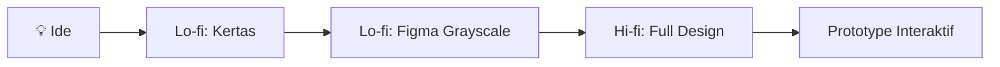

# Wireframe — Dari Kertas ke Figma

Wireframe adalah sketsa struktural antarmuka — fokus pada **layout dan konten**, bukan warna atau estetika.

## Lo-fi vs Hi-fi



| | Lo-fi | Hi-fi |
|--|-------|-------|
| Waktu | Menit | Jam/hari |
| Tools | Kertas, whiteboard | Figma, Sketch |
| Tujuan | Eksplorasi cepat | Validasi desain |
| Warna | Hitam-putih | Full color |
| Kapan | Awal proses | Setelah konsep valid |

**Aturan:** Jangan langsung hi-fi. Selesaikan struktur dulu, baru estetika.

## Information Architecture

Sebelum wireframe, tentukan hierarki informasi:

```
Halaman utama
├── Hero section (judul + CTA)
├── Fitur unggulan (3 kartu)
├── Testimonial
├── Pricing
└── Footer

Navigasi
├── Logo
├── Menu utama (5 item max)
└── CTA button
```

**Card sorting** — teknik untuk menentukan struktur navigasi yang intuitif:
1. Tulis setiap halaman/fitur di sticky note terpisah
2. Minta 5 pengguna mengelompokkan sticky note secara bebas
3. Pola yang muncul = struktur navigasi yang pengguna harapkan

## Wireframe di Figma

### Setup Dasar

```
1. New File → Frame (F)
2. Pilih device: iPhone 14, Desktop 1440
3. Warna terbatas: hitam (#000), abu (#999, #ccc), putih (#fff)
4. Font tunggal: Inter semua ukuran
```

### Komponen Wireframe Standar

```
Placeholder gambar:  Kotak + tanda X diagonal
Teks:               Garis-garis horizontal (atau teks lorem ipsum)
Tombol:             Kotak dengan label
Icon:               Kotak kecil dengan nama
Navigation bar:     Bar horisontal di atas/bawah
Input field:        Kotak dengan label di atas
```

### Anatomi Halaman yang Baik

```
┌────────────────────────┐
│       NAVIGATION       │  ← Fixed, selalu visible
├────────────────────────┤
│                        │
│         HERO           │  ← First impression, CTA utama
│    [Judul] [Tombol]    │
│                        │
├────────────────────────┤
│  [Card]  [Card]  [Card]│  ← Konten utama dalam grid
├────────────────────────┤
│         FOOTER         │  ← Link tambahan, copyright
└────────────────────────┘
```

## 5 Prinsip Wireframe yang Baik

1. **Konsistensi** — elemen serupa terlihat dan berperilaku sama
2. **Satu aksi utama per halaman** — jangan bingungkan pengguna dengan banyak CTA
3. **Progressive disclosure** — tampilkan informasi bertahap, bukan semua sekaligus
4. **Familiar patterns** — gunakan pola yang sudah pengguna kenal (hamburger menu, breadcrumb, dll)
5. **Mobile first** — desain untuk layar kecil dulu, baru scale up

## Latihan

Wireframe aplikasi "Digital Lab SMA UII" untuk mobile:
1. Sketsa di kertas dulu (5 menit): halaman login, dashboard, halaman track
2. Pindahkan ke Figma dengan grayscale
3. Tunjukkan ke 2 teman — tanpa penjelasan apapun, minta mereka "klik" seolah menggunakan aplikasi
4. Catat di mana mereka bingung → itu yang perlu diperbaiki
