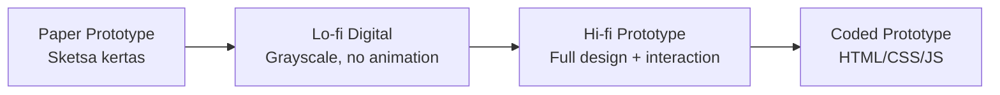

# Prototype Interaktif di Figma

Prototype mengubah desain statis menjadi simulasi produk yang bisa diklik — memungkinkan testing sebelum development.

## Jenis Prototype



Untuk sebagian besar testing, **hi-fi Figma prototype** sudah cukup — tidak perlu sampai coded.

## Dasar Prototyping di Figma

### Connections (Link antar frame)

1. Masuk ke tab **Prototype** di panel kanan
2. Hover elemen → muncul titik biru di tepi
3. Drag titik biru ke frame tujuan
4. Set trigger: On Click, On Hover, After Delay, dll

### Trigger Types

| Trigger | Kapan dipakai |
|---------|--------------|
| On Click | Tombol, link, card |
| On Hover | Tooltip, dropdown preview |
| After Delay | Loading screen, splash screen |
| On Drag | Carousel, swipe gesture |
| Key/Gamepad | Keyboard shortcut |

### Animation Types

```
Instant      → langsung pindah, tanpa animasi
Dissolve     → fade in/out
Smart Animate → Figma otomatis interpolasi posisi/ukuran
Move In/Out  → slide dari arah tertentu
Push         → screen baru mendorong screen lama
```

**Smart Animate** adalah yang paling powerful — pastikan nama layer sama di kedua frame untuk animasi yang smooth.

## Micro-interactions

Detail kecil yang membuat produk terasa "hidup":

### Hover State

```
Default button:  background #3b82f6
Hover button:    background #2563eb (lebih gelap)
Transition:      200ms ease
```

Di Figma: buat 2 variant (Default, Hover) → prototype connection On Hover.

### Loading State

```
Tombol "Simpan" → klik → tombol berubah jadi "Menyimpan..." + spinner
                → selesai → "Tersimpan ✓" (hijau, 2 detik)
                → kembali ke "Simpan"
```

### Form Validation

```
Input kosong + submit → border merah + pesan error muncul
Input valid           → border hijau + checkmark
```

## Prototype Flow yang Baik

Setiap prototype harus punya **starting point** yang jelas:

```
1. Set starting frame: klik kanan frame → "Set as starting point"
2. Buat flow yang lengkap: login → dashboard → fitur utama
3. Handle error state: form error, empty state, loading
4. Tambah back navigation: tombol back, swipe gesture
```

## Sharing & Presenting

```
Share prototype:
  Figma → Share → "Anyone with link" → Copy link prototype

Present mode:
  Ctrl/Cmd + Alt + Enter → fullscreen presentation
  
Hotspot hints:
  Figma → Prototype settings → "Show hotspot hints on click"
  → Berguna saat usability testing agar pengguna tidak bingung
```

## Latihan

Buat prototype hi-fi untuk aplikasi Digital Lab SMA UII:
1. Minimal 5 screen: splash, onboarding, login, dashboard, halaman track
2. Semua tombol utama harus bisa diklik
3. Tambah loading state untuk proses login
4. Tambah hover state untuk semua tombol
5. Share link prototype ke teman dan minta mereka "gunakan" tanpa penjelasan
