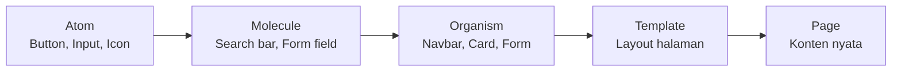

# Design System & Komponen

Design system adalah "bahasa visual" yang konsisten — memastikan semua bagian produk terlihat dan terasa satu kesatuan.

## Mengapa Design System?

Tanpa design system:
- Button di halaman A berbeda dari halaman B
- Developer tebak-tebakan ukuran spacing
- Onboarding designer baru butuh berminggu-minggu
- Setiap update visual harus diubah di ratusan tempat

Dengan design system:
- Konsistensi dijaga secara sistematis
- Update satu komponen → semua instance terupdate
- Developer dan designer berbicara "bahasa" yang sama

## Atomic Design



**Atom** — elemen terkecil yang tidak bisa dipecah lagi
**Molecule** — kombinasi beberapa atom
**Organism** — kombinasi molecule yang membentuk bagian UI yang bermakna
**Template** — layout tanpa konten nyata
**Page** — template dengan konten nyata

## Design Tokens

Token adalah nilai desain yang diberi nama semantik:

```
❌ Hardcoded (susah di-maintain):
   color: #3b82f6
   font-size: 16px
   padding: 12px 24px

✅ Tokenized:
   color: $color-primary-500
   font-size: $text-base
   padding: $space-3 $space-6
```

### Token yang Wajib Ada

```
Color tokens:
  color-primary-{50-900}
  color-neutral-{50-900}
  color-success, color-warning, color-error, color-info

Typography tokens:
  font-family-sans, font-family-mono
  font-size-{xs, sm, base, lg, xl, 2xl, 3xl, 4xl}
  font-weight-{regular, medium, semibold, bold}
  line-height-{tight, normal, relaxed}

Spacing tokens:
  space-{1:4px, 2:8px, 3:12px, 4:16px, 5:20px, 6:24px, 8:32px, 10:40px, 12:48px}

Border tokens:
  radius-{sm:4px, md:8px, lg:12px, xl:16px, full:9999px}
  border-width-{1, 2, 4}

Shadow tokens:
  shadow-{sm, md, lg, xl}
```

## Komponen di Figma

### Cara Membuat Komponen

1. Desain elemen (misal: button)
2. Select → `Cmd/Ctrl + Alt + K` → Create Component
3. Beri nama dengan slash notation: `Button/Primary/Default`
4. Buat variant: hover, pressed, disabled, loading

### Naming Convention

```
Komponen/Variant/State

Contoh:
  Button/Primary/Default
  Button/Primary/Hover
  Button/Primary/Disabled
  Button/Secondary/Default
  Input/Text/Default
  Input/Text/Error
  Input/Text/Filled
  Card/Default
  Card/Hover
```

### Auto Layout

Auto layout membuat komponen responsif secara otomatis:

```
Button tanpa auto layout → ubah teks = overflow atau terlalu besar
Button dengan auto layout → ubah teks = padding otomatis menyesuaikan
```

Shortcut: `Shift + A`

## Latihan

1. Buat design system mini untuk aplikasi belajar:
   - Color tokens (primary + neutral 9 shade)
   - Typography scale (6 ukuran)
   - Spacing scale (8-point grid)
2. Buat 3 komponen dengan auto layout + variants:
   - Button (Primary, Secondary, Ghost × Default, Hover, Disabled)
   - Input (Default, Focus, Error, Disabled)
   - Card (Default, Hover)
3. Gunakan komponen tersebut untuk desain ulang halaman yang sudah kamu wireframe
