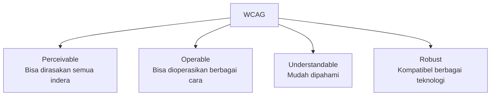

# Aksesibilitas & Inclusive Design

Desain yang baik bekerja untuk semua orang — termasuk yang punya keterbatasan penglihatan, pendengaran, atau motorik.

## Mengapa Aksesibilitas Penting?

- **Etis** — semua orang berhak mengakses informasi digital
- **Legal** — banyak negara mewajibkan aksesibilitas (ADA, WCAG)
- **Bisnis** — 15% populasi dunia punya disabilitas = pasar besar
- **Universal benefit** — fitur aksesibilitas membantu semua orang (subtitle membantu di tempat bising, kontras tinggi membantu di bawah sinar matahari)

## WCAG — 4 Prinsip



## Kontras Warna

Sudah dibahas di lesson tipografi, tapi ini yang paling sering dilanggar:

```
Teks normal (< 18px):  rasio minimum 4.5:1
Teks besar (≥ 18px):   rasio minimum 3:1
UI components:         rasio minimum 3:1

Contoh yang gagal:
  Teks abu #999 di background putih → rasio 2.85:1 ❌
  
Contoh yang lulus:
  Teks abu #767676 di background putih → rasio 4.54:1 ✅
```

Tools: [WebAIM Contrast Checker](https://webaim.org/resources/contrastchecker/)

## Focus States

Pengguna keyboard dan screen reader navigasi dengan Tab. Setiap elemen interaktif harus punya focus state yang jelas:

```css
/* ❌ Jangan hapus focus outline */
button:focus { outline: none; }

/* ✅ Custom focus yang tetap visible */
button:focus-visible {
  outline: 2px solid #3b82f6;
  outline-offset: 2px;
}
```

Di Figma: buat variant "Focus" untuk semua komponen interaktif.

## Alt Text untuk Gambar

```html
<!-- ❌ Tidak ada alt text -->


<!-- ❌ Alt text tidak informatif -->


<!-- ✅ Alt text deskriptif -->


<!-- ✅ Gambar dekoratif — alt kosong -->

```

## Touch Target Size

Jari manusia rata-rata 44px × 44px. Semua elemen yang bisa diklik harus minimal ukuran itu:

```
❌ Icon 16px tanpa padding → susah diklik di mobile
✅ Icon 16px + padding 14px = touch target 44px
```

Di Figma: gunakan auto layout dengan padding untuk memastikan touch target cukup besar.

## Color Blindness

8% pria mengalami color blindness. Jangan andalkan warna saja untuk menyampaikan informasi:

```
❌ Hanya warna: tombol merah = error, hijau = sukses
✅ Warna + ikon: ❌ Error: "Email tidak valid" 
                 ✅ Sukses: "Berhasil disimpan"
```

Plugin Figma: **Stark** — simulasi berbagai tipe color blindness.

## Rangkuman

- Kontras minimum 4.5:1 untuk teks normal
- Focus state wajib ada dan visible
- Alt text deskriptif untuk semua gambar bermakna
- Touch target minimal 44×44px
- Jangan andalkan warna saja

## Latihan

Audit desain yang sudah kamu buat:
1. Cek semua kontras warna dengan WebAIM Contrast Checker
2. Install plugin Stark di Figma → simulasi deuteranopia (color blindness paling umum)
3. Pastikan semua tombol punya touch target ≥ 44px
4. Tambah focus state ke semua komponen interaktif
5. Hitung: berapa % desainmu yang sudah accessible?
