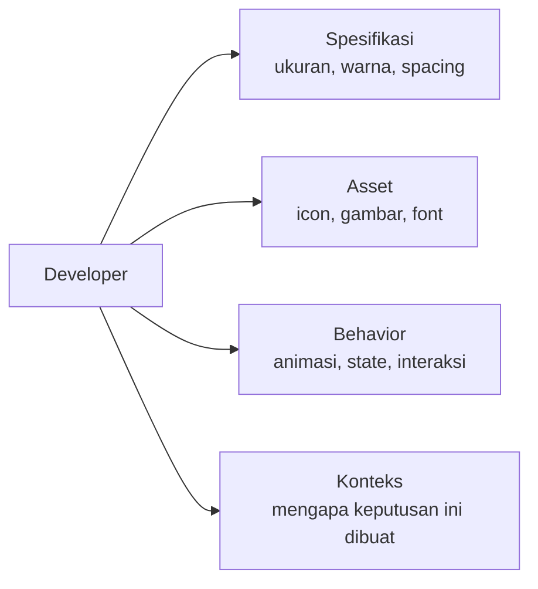

# Handoff ke Developer

Desain yang bagus bisa rusak di implementasi jika handoff tidak dilakukan dengan benar. Handoff yang baik = developer tidak perlu tebak-tebakan.

## Apa yang Developer Butuhkan?



## Figma Inspect Panel

Developer bisa buka Figma dan inspect langsung:

```
1. Share file → "Anyone with link" → "can view"
2. Developer buka link → klik elemen → panel kanan
3. Panel menampilkan:
   - CSS properties (color, font, padding, dll)
   - Ukuran dan posisi
   - Export options
```

**Tapi** — inspect panel saja tidak cukup. Developer masih perlu konteks.

## Annotation

Tambahkan catatan langsung di Figma untuk hal yang tidak obvious:

```
Contoh annotation yang berguna:
  → "Tombol ini disabled jika form belum lengkap"
  → "Animasi: slide up 300ms ease-out"
  → "Error message muncul setelah 500ms delay (bukan langsung)"
  → "Maksimal 2 baris teks, overflow ellipsis"
  → "Warna ini harus sama persis dengan brand guideline"
```

Plugin Figma: **Redlines** atau **Figma Tokens** untuk annotation otomatis.

## Naming Convention untuk Developer

Layer name di Figma = class name yang developer pakai:

```
❌ Buruk:
  Frame 1
  Rectangle 23
  Group 5

✅ Baik:
  card/product
  button/primary
  icon/search
  text/heading-1
```

## Export Assets

```
Icon SVG:
  Select icon → Export → SVG
  Pastikan: "Include id attribute" off, viewBox ada

Gambar:
  Select → Export → PNG 2x (untuk retina)
  Atau WebP untuk web performance

Font:
  Cantumkan nama font, weight, dan link Google Fonts/CDN
```

## Design Tokens untuk Developer

Alih-alih bilang "warna biru ini", berikan nama token:

```json
{
  "color": {
    "primary": {
      "500": "#3b82f6",
      "600": "#2563eb",
      "700": "#1d4ed8"
    },
    "neutral": {
      "900": "#111827",
      "500": "#6b7280",
      "100": "#f3f4f6"
    }
  },
  "spacing": {
    "1": "4px",
    "2": "8px",
    "4": "16px",
    "6": "24px"
  },
  "radius": {
    "sm": "4px",
    "md": "8px",
    "lg": "12px",
    "full": "9999px"
  }
}
```

Plugin Figma: **Tokens Studio** untuk export design tokens ke JSON.

## Checklist Handoff

```
[ ] Semua layer diberi nama yang bermakna
[ ] Komponen menggunakan auto layout (bukan fixed size)
[ ] Semua state ada: default, hover, focus, disabled, error
[ ] Animasi dan transisi didokumentasikan
[ ] Asset sudah di-export dengan nama yang benar
[ ] Design tokens didokumentasikan
[ ] Edge cases didokumentasikan (teks panjang, empty state, loading)
[ ] Link ke prototype untuk referensi behavior
```

## Latihan

1. Ambil desain yang sudah kamu buat
2. Rename semua layer menggunakan naming convention yang benar
3. Tambahkan annotation untuk 5 behavior yang tidak obvious
4. Export semua icon sebagai SVG
5. Buat dokumen design tokens (JSON atau Notion) untuk warna dan spacing
