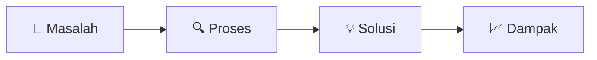

# Menulis Case Study yang Meyakinkan

Portofolio designer bukan galeri screenshot — ini adalah bukti bahwa kamu bisa **berpikir**, bukan hanya membuat sesuatu yang cantik.

## Yang Recruiter Sebenarnya Cari

> "Tunjukkan prosesmu, bukan hanya hasilnya."

Recruiter ingin tahu:
1. Apakah kamu memahami masalah pengguna?
2. Bagaimana kamu membuat keputusan desain?
3. Apakah kamu bisa berkolaborasi dan menerima feedback?
4. Apakah desainmu berdampak nyata?

## Struktur Case Study



### Template Case Study

```markdown
## [Nama Proyek] — [Tagline singkat]

### Overview
- **Role:** UI/UX Designer
- **Timeline:** 3 minggu
- **Tools:** Figma, FigJam, Maze
- **Team:** Solo / 2 designer + 1 developer

### Masalah
[1-2 paragraf: konteks, siapa penggunanya, masalah spesifik yang dipecahkan]

"Bagaimana kita bisa [mencapai tujuan] untuk [pengguna target] yang [menghadapi masalah]?"

### Riset
[Apa yang kamu lakukan untuk memahami masalah?]
- 5 user interview
- Competitive analysis (3 produk sejenis)
- Temuan utama: [3 insight paling penting]

### Proses Desain
[Perjalanan dari ide ke solusi — tunjukkan iterasi!]
- Sketsa awal dan eksplorasi
- Wireframe lo-fi dan feedback yang diterima
- Perubahan berdasarkan feedback
- Desain final

### Solusi
[Screenshot/mockup dengan penjelasan mengapa setiap keputusan dibuat]

### Dampak
[Jika ada data, cantumkan. Jika tidak ada, jelaskan asumsi dan metrics yang akan diukur]
- Usability test: 4/5 pengguna berhasil menyelesaikan task utama
- Task completion rate naik dari 60% → 85%

### Pelajaran
[Apa yang kamu pelajari? Apa yang akan kamu lakukan berbeda?]
```

## Kesalahan Umum Case Study

| ❌ Hindari | ✅ Lakukan |
|-----------|----------|
| "Saya membuat UI yang cantik" | "Saya menemukan bahwa pengguna kesulitan X, dan solusi saya adalah Y" |
| Hanya screenshot final | Tunjukkan sketsa awal, iterasi, dan proses |
| Tidak ada konteks masalah | Jelaskan mengapa proyek ini penting |
| Terlalu panjang (10.000 kata) | 500-1500 kata, visual yang kuat |
| Tidak ada self-reflection | Akui kekurangan dan apa yang dipelajari |

## Platform Portofolio

| Platform | Kelebihan | Cocok untuk |
|----------|-----------|-------------|
| **Behance** | Discovery tinggi, komunitas besar | Showcase visual |
| **Dribbble** | Visual-focused, prestisius | Shot pendek, micro-interaction |
| **Notion** | Fleksibel, mudah update | Case study panjang |
| **Website sendiri** | Full control, custom domain | Profesional, personal branding |
| **Figma Community** | Langsung dari tool kerja | Template, UI kit |

## Memulai Tanpa Pengalaman Kerja

1. **Redesign proyek nyata** — pilih app yang punya masalah nyata, redesign dan dokumentasikan prosesnya
2. **Proyek fiktif** — "Bagaimana jika SMA UII punya app jadwal pelajaran?" — desain dari nol
3. **Hackathon/kompetisi** — gemastik, design challenge brand lokal
4. **Kontribusi open source** — bantu proyek open source dengan desain UI

## Latihan

1. Pilih satu dari lesson atau proyek yang sudah kamu kerjakan
2. Tulis case study menggunakan template di atas (min. 3 iterasi desain yang didokumentasikan)
3. Publish di Behance atau Notion
4. Minta 2 feedback dari teman sebelum share ke publik
