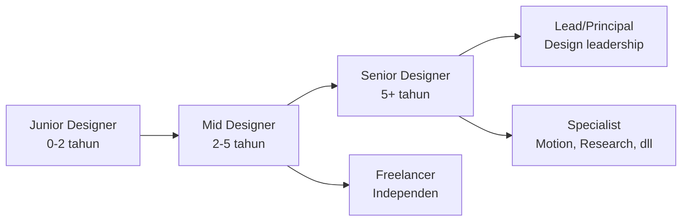

# Freelance & Karir Designer

Setelah punya portofolio, langkah berikutnya adalah membangun karir — baik sebagai freelancer maupun full-time designer.

## Jalur Karir UI/UX



## Mulai Freelance Saat Masih SMA

Tidak perlu tunggu lulus — banyak UMKM dan startup butuh designer dengan budget terbatas:

**Platform untuk mulai:**
- **Fastwork** — platform freelance Indonesia terbesar
- **Sribulancer** — khusus Indonesia
- **Fiverr** — global, butuh bahasa Inggris
- **Upwork** — global, lebih kompetitif

**Proyek pertama yang realistis:**
- Desain logo (Rp 200-500rb)
- Desain feed Instagram (Rp 300-800rb)
- Landing page sederhana (Rp 500rb-2jt)
- Redesign UI aplikasi (Rp 1-5jt)

## Menentukan Harga

```
Jangan tanya "berapa yang wajar?" — tanya "berapa nilai yang kamu berikan?"

Formula sederhana:
  Estimasi jam × rate per jam = harga proyek

Rate per jam untuk pemula Indonesia:
  Rp 50.000-150.000/jam (tergantung kompleksitas dan klien)

Contoh:
  Landing page = 20 jam × Rp 75.000 = Rp 1.500.000
```

**Tips:** Selalu minta 50% di awal, 50% setelah selesai. Buat kontrak sederhana.

## Skill yang Membedakan Designer Biasa vs Bagus

| Designer Biasa | Designer Bagus |
|---------------|----------------|
| Hanya bisa Figma | Figma + riset + presentasi |
| Menunggu brief | Proaktif tanya dan klarifikasi |
| Deliver file saja | Deliver + penjelasan keputusan |
| Tidak bisa terima kritik | Iterasi berdasarkan feedback |
| Hanya tahu UI | Paham bisnis dan user |

## Networking

Komunitas designer Indonesia yang aktif:
- **Dribbble Indonesia** — showcase karya
- **UX Indonesia** (Telegram/Discord) — diskusi dan job posting
- **Behance** — portofolio dan networking
- **LinkedIn** — koneksi profesional

**Tips networking:**
- Berikan nilai dulu sebelum minta sesuatu
- Komentari karya orang lain dengan feedback yang konstruktif
- Bagikan proses belajarmu — orang suka melihat growth

## Terus Belajar

UI/UX berkembang cepat. Sumber belajar terbaik:

| Sumber | Konten |
|--------|--------|
| [Nielsen Norman Group](https://nngroup.com) | Riset UX berbasis data |
| [Refactoring UI](https://refactoringui.com) | Praktis, langsung bisa diterapkan |
| [Mobbin](https://mobbin.com) | Referensi UI dari app nyata |
| [Dribbble](https://dribbble.com) | Inspirasi visual |
| [Laws of UX](https://lawsofux.com) | Prinsip psikologi dalam desain |

## Latihan

1. Buat profil di Fastwork atau Sribulancer
2. Upload 2-3 karya terbaik dari latihan di track ini
3. Tentukan rate per jam yang realistis untuk skill kamu saat ini
4. Hubungi 1 UMKM di sekitarmu — tawarkan redesign Instagram feed gratis sebagai portofolio pertama
5. Bergabung dengan komunitas UX Indonesia dan perkenalkan diri
