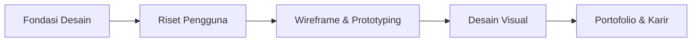

# Desain UI/UX

Track ini mempersiapkan kamu untuk menjadi designer yang tidak hanya membuat tampilan cantik, tapi juga **memecahkan masalah nyata pengguna**.

## Mengapa UI/UX?

Di era digital, produk yang berhasil bukan yang paling canggih secara teknis — tapi yang paling mudah dan menyenangkan digunakan. Designer UI/UX adalah jembatan antara kebutuhan manusia dan teknologi.

> "Design is not just what it looks like and feels like. Design is how it works." — Steve Jobs

## Roadmap

## Modul

1. **Fondasi Desain** — Prinsip desain, tipografi, warna, layout
2. **Riset Pengguna** — User interview, persona, user journey map
3. **Wireframe & Prototyping** — Lo-fi hingga hi-fi prototype di Figma
4. **Desain Visual** — Design system, komponen, dark mode, aksesibilitas
5. **Portofolio & Karir** — Presentasi karya, case study, freelance

## Tools yang Digunakan

- **Figma** — industri standar untuk UI/UX design (gratis untuk pelajar)
- **FigJam** — whiteboard kolaborasi untuk riset dan ideasi
- **Maze** — usability testing online

## Prasyarat

Tidak ada prasyarat teknis. Yang dibutuhkan hanya:
- Rasa empati terhadap pengguna
- Kemampuan observasi yang baik
- Kemauan untuk menerima feedback dan iterasi
