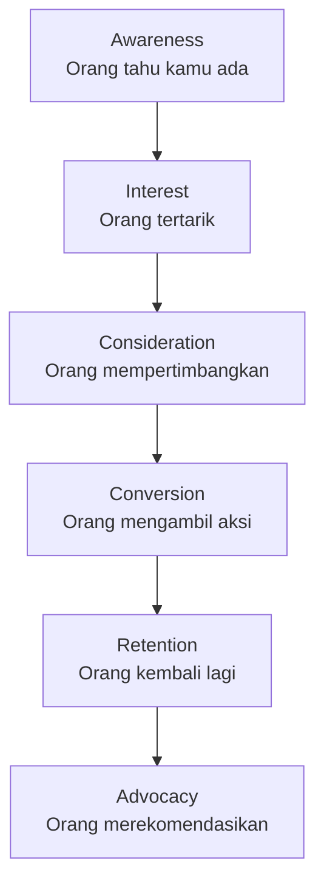

# Strategi & Marketing Funnel

Marketing yang efektif dimulai dari pemahaman tentang perjalanan audiens — dari tidak tahu produkmu hingga menjadi pengguna setia.

## Marketing Funnel



Setiap tahap butuh strategi berbeda. Kesalahan umum: langsung push conversion ke orang yang belum pernah dengar produkmu.

## TOFU, MOFU, BOFU

| Tahap | Singkatan | Tujuan | Contoh Konten |
|-------|-----------|--------|---------------|
| Atas funnel | TOFU | Awareness | Blog, video edukatif, infografis |
| Tengah funnel | MOFU | Consideration | Case study, webinar, demo |
| Bawah funnel | BOFU | Conversion | Testimoni, trial gratis, diskon |

## Target Audiens & Buyer Persona

Jangan marketing ke "semua orang" — itu artinya tidak ke siapapun.

**Buyer Persona** adalah representasi semi-fiktif dari pelanggan ideal:

```markdown
## Persona: Andi, Siswa Baru SMA UII

Demografi:
- Usia: 15 tahun, baru masuk kelas X
- Asal: Yogyakarta dan sekitarnya
- Perangkat: HP Android, sesekali laptop sekolah

Goals:
- Ingin belajar coding tapi tidak tahu mulai dari mana
- Ingin punya portofolio sebelum kuliah

Pain Points:
- Tutorial di YouTube terlalu panjang dan membosankan
- Tidak ada teman yang bisa diajak belajar bareng
- Takut dianggap "nerd" oleh teman sekelas

Channels:
- TikTok (2-3 jam/hari)
- Instagram (1 jam/hari)
- YouTube (malam hari)
- Jarang buka email
```

## Unique Value Proposition (UVP)

Apa yang membuat produkmu berbeda dari kompetitor?

**Formula UVP:**
> "Kami membantu [target audiens] untuk [mencapai tujuan] dengan [cara yang berbeda/lebih baik]."

**Contoh untuk Digital Lab SMA UII:**
> "Kami membantu siswa SMA UII belajar teknologi secara praktis melalui komunitas peer-learning dan proyek nyata — bukan sekadar teori."

## OKR untuk Marketing

**Objectives and Key Results** — cara menetapkan dan mengukur tujuan:

```
Objective: Tingkatkan awareness Digital Lab di kalangan siswa baru

Key Results:
  KR1: 200 follower Instagram baru dalam 3 bulan
  KR2: 50 pendaftar baru di platform
  KR3: 1000 unique visitor/bulan di website
```

## Rangkuman

- Funnel membantu memahami di mana audiens berada dalam perjalanan mereka
- Persona membuat marketing lebih tepat sasaran
- UVP membedakan kamu dari kompetitor
- OKR membuat tujuan terukur dan akuntabel

## Latihan

Untuk komunitas Digital Lab SMA UII:
1. Buat 2 buyer persona yang berbeda (siswa baru vs siswa yang sudah aktif)
2. Tulis UVP dalam 1 kalimat
3. Buat OKR untuk 1 kuartal ke depan (3 objective, masing-masing 2-3 KR)
4. Identifikasi: di tahap funnel mana sebagian besar audiens kamu berada?
