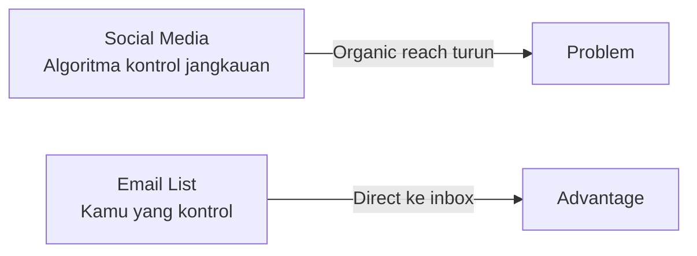

# Email Marketing

Email adalah channel dengan ROI tertinggi di digital marketing — rata-rata $36 untuk setiap $1 yang diinvestasikan. Dan tidak ada algoritma yang bisa memotong jangkauanmu.

## Mengapa Email Masih Relevan?



- **Owned channel** — tidak bergantung pada algoritma platform
- **High intent** — orang yang subscribe memang mau dengar dari kamu
- **Personalisasi** — bisa segmentasi dan kirim konten yang relevan
- **Measurable** — open rate, click rate, conversion rate semua terukur

## Membangun Email List

**Lead magnet** — berikan sesuatu yang bernilai sebagai imbalan email:

```
Contoh lead magnet untuk Digital Lab:
  ✅ "Roadmap Belajar Coding untuk Siswa SMA" (PDF)
  ✅ "Checklist Setup Environment Developer" 
  ✅ "Template GitHub Profile README"
  ✅ Akses early ke konten baru
```

**Tempat menaruh form subscribe:**
- Hero section website
- Akhir setiap artikel blog
- Pop-up (exit intent — muncul saat mau keluar)
- Bio Instagram/TikTok (link di bio)

## Anatomi Email yang Efektif

```
Subject line:    "3 hal yang saya pelajari minggu ini 🧵"
Preview text:    "Plus: resource gratis yang mengubah cara saya belajar Git"
─────────────────────────────────────────────────────
[Logo / Nama]

Halo [Nama],

[Hook — 1-2 kalimat yang langsung relevan]

[Konten utama — singkat, scannable, ada value]

[CTA — satu aksi yang jelas]

[Tanda tangan personal]

─────────────────────────────────────────────────────
[Unsubscribe] [View in browser]
```

## Subject Line yang Dibuka

```
Formula yang terbukti:
  Angka:       "5 tools gratis yang saya pakai setiap hari"
  Pertanyaan:  "Sudah tahu cara ini?"
  Personalisasi: "Halo [Nama], ini untuk kamu"
  Curiosity:   "Saya hampir menyerah... tapi kemudian"
  FOMO:        "Hanya tersedia sampai Minggu"

Hindari:
  ❌ ALL CAPS
  ❌ Terlalu banyak tanda seru!!!
  ❌ Kata spam: "GRATIS", "MENANG", "KLIK SEKARANG"
```

## Metrics Email Marketing

| Metric | Rata-rata industri | Target |
|--------|-------------------|--------|
| Open rate | 20-25% | > 30% |
| Click rate | 2-3% | > 5% |
| Unsubscribe rate | < 0.5% | < 0.2% |
| Bounce rate | < 2% | < 1% |

## Tools Gratis

- **Mailchimp** — gratis hingga 500 subscriber
- **Brevo (Sendinblue)** — gratis 300 email/hari
- **ConvertKit** — gratis hingga 1000 subscriber (terbaik untuk creator)

## Latihan

1. Buat akun Mailchimp atau ConvertKit
2. Desain lead magnet sederhana untuk Digital Lab (PDF 1 halaman)
3. Buat form subscribe dan embed di halaman website
4. Tulis email welcome series 3 email:
   - Email 1: Selamat datang + deliver lead magnet
   - Email 2: Cerita tentang Digital Lab
   - Email 3: Ajakan bergabung komunitas
