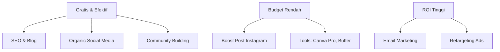

# Marketing Budget & ROI

Marketing yang tidak diukur adalah pengeluaran. Marketing yang diukur adalah investasi.

## Metrics Keuangan Marketing

### CAC — Customer Acquisition Cost

$$\text{CAC} = \frac{\text{Total Biaya Marketing}}{\text{Jumlah Customer Baru}}$$

**Contoh:**
```
Bulan April:
  Biaya iklan Instagram: Rp 500.000
  Biaya konten (waktu): Rp 200.000
  Total: Rp 700.000
  
  Member baru: 35 orang
  
  CAC = Rp 700.000 / 35 = Rp 20.000 per member
```

### LTV — Lifetime Value

Untuk komunitas gratis, LTV bisa diukur dari nilai tidak langsung:

```
LTV komunitas:
  → Referral value: setiap member rata-rata ajak 2 teman
  → Brand value: member aktif = ambassador
  → Future revenue: jika ada program berbayar nanti
```

### ROAS — Return on Ad Spend

$$\text{ROAS} = \frac{\text{Revenue dari Iklan}}{\text{Biaya Iklan}}$$

ROAS > 3× dianggap profitable untuk kebanyakan bisnis.

## Alokasi Budget Marketing

**Framework 70-20-10:**

```
70% → Channel yang sudah terbukti bekerja
      (Instagram organic, SEO blog)

20% → Channel yang sedang ditest
      (TikTok, email marketing)

10% → Eksperimen baru
      (Podcast, YouTube, kolaborasi baru)
```

## Budget untuk Komunitas Gratis

Tidak punya budget? Gunakan "sweat equity":

```
Biaya waktu (estimasi):
  Konten Instagram (3x/minggu): 3 jam/minggu
  Blog post (1x/minggu):        4 jam/minggu
  Community management:         2 jam/minggu
  Total: ~9 jam/minggu

Nilai waktu @ Rp 50.000/jam:
  9 jam × Rp 50.000 = Rp 450.000/minggu "investasi"
```

Hitung ROI berdasarkan member baru, engagement, dan nilai jangka panjang.

## Prioritas Investasi Marketing



## Marketing Calendar & Budget Tracker

```markdown
| Bulan | Channel | Budget | Hasil | CAC | Notes |
|-------|---------|--------|-------|-----|-------|
| Apr   | Instagram Ads | Rp 500K | 35 member | Rp 14K | |
| Apr   | Blog SEO | Rp 0 | 120 visitor | Rp 0 | Artikel "Cara Belajar Git" |
| Mei   | TikTok | Rp 0 | 50 follower | - | Test organic dulu |
```

## Latihan

1. Hitung CAC Digital Lab untuk bulan ini (estimasi biaya waktu + tools)
2. Buat alokasi budget marketing Rp 500.000/bulan menggunakan framework 70-20-10
3. Identifikasi channel mana yang paling cost-effective saat ini
4. Buat marketing budget tracker sederhana di Google Sheets
5. Tentukan target CAC yang ingin dicapai dalam 3 bulan ke depan
