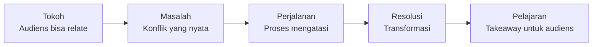

# Copywriting & Storytelling

Copywriting adalah seni menulis untuk menggerakkan orang mengambil aksi. Storytelling adalah cara membuat pesan yang diingat.

## Perbedaan Content Writing vs Copywriting

| Content Writing | Copywriting |
|----------------|-------------|
| Mendidik dan menginformasi | Menggerakkan aksi |
| Blog, artikel, tutorial | Iklan, landing page, email |
| Sukses = dibaca sampai selesai | Sukses = klik, daftar, beli |
| Panjang | Singkat dan padat |

Keduanya dibutuhkan — content writing membangun kepercayaan, copywriting mengkonversi.

## Formula Copywriting

### AIDA

```
Attention  → Tarik perhatian dengan headline yang kuat
Interest   → Bangun ketertarikan dengan fakta/masalah yang relevan
Desire     → Ciptakan keinginan dengan manfaat yang jelas
Action     → Dorong aksi dengan CTA yang spesifik
```

**Contoh:**

```
[A] Belajar coding 3 bulan, dapat kerja sebelum lulus SMA?

[I] 73% siswa yang aktif di komunitas developer sejak SMA 
    berhasil magang di perusahaan teknologi sebelum kuliah.

[D] Di Digital Lab SMA UII, kamu belajar dengan proyek nyata,
    dibimbing alumni yang sudah bekerja di industri, dan 
    membangun portofolio GitHub yang bisa dilihat recruiter.

[A] Daftar sekarang — gratis untuk siswa SMA UII.
    [Mulai Belajar →]
```

### PAS (Problem-Agitate-Solution)

```
Problem  → Identifikasi masalah yang dirasakan audiens
Agitate  → Perbesar rasa sakit — apa yang terjadi jika tidak diatasi?
Solution → Tawarkan solusimu sebagai jawaban
```

## Headline yang Kuat

Headline menentukan apakah orang akan membaca lebih lanjut. 80% orang membaca headline, hanya 20% yang membaca isinya.

**Formula headline:**
- **Angka:** "7 Cara Belajar Coding yang Terbukti Efektif"
- **How-to:** "Cara Membuat Portfolio GitHub yang Dilirik Recruiter"
- **Pertanyaan:** "Kenapa Siswa SMA Ini Sudah Dapat Internship?"
- **Kontroversi:** "Tutorial Coding di YouTube Itu Buang Waktu"
- **FOMO:** "Skill yang Wajib Dikuasai Sebelum Masuk Kuliah IT"

## Storytelling

Otak manusia 22× lebih mudah mengingat cerita daripada fakta.

**Struktur cerita yang efektif:**



**Contoh untuk Digital Lab:**

> Sandi masuk SMA UII tanpa tahu apa itu programming. Dia ingin masuk jurusan Informatika tapi tidak tahu harus mulai dari mana. Setelah bergabung dengan Digital Lab, dia mulai dari Git dan HTML — hal-hal yang terasa kecil tapi membangun fondasi. Tiga bulan kemudian, dia punya portfolio GitHub dengan 5 proyek. Enam bulan kemudian, dia dapat internship di startup Yogyakarta. Pelajarannya: mulai dari yang kecil, konsisten, dan jangan belajar sendirian.

## CTA (Call to Action) yang Efektif

```
❌ Lemah:
  "Klik di sini"
  "Submit"
  "Learn more"

✅ Kuat:
  "Mulai Belajar Gratis →"
  "Daftar Sekarang — Gratis untuk Siswa SMA UII"
  "Download Roadmap Belajar Coding"
```

**Prinsip CTA:**
- Spesifik tentang apa yang terjadi setelah klik
- Gunakan kata kerja aktif
- Tunjukkan nilai, bukan hanya aksi
- Satu CTA per halaman/email

## Latihan

1. Tulis headline untuk 3 konten berbeda tentang Digital Lab menggunakan formula yang berbeda
2. Tulis copy landing page Digital Lab menggunakan formula AIDA (max 200 kata)
3. Tulis cerita singkat (150 kata) tentang transformasi siswa yang bergabung dengan Digital Lab
4. Minta 2 teman membaca copy-mu — apakah mereka ingin klik CTA-nya?
