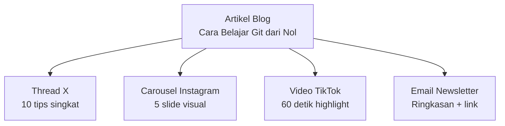

# Content Calendar & Repurposing

Konsistensi mengalahkan kesempurnaan. Satu konten per minggu secara konsisten lebih efektif dari 10 konten sekaligus lalu diam sebulan.

## Mengapa Content Calendar?

Tanpa calendar: posting hanya saat ada ide, tidak strategis, panik saat deadline.
Dengan calendar: konsistensi terjaga, konten selaras tujuan, bisa batch-create.

## Content Pillars

Tentukan 3-5 tema utama yang selalu kamu bahas:

```
Pillar 1: Edukasi Teknologi (40%) → tutorial, tips, penjelasan konsep
Pillar 2: Komunitas & Cerita (30%) → highlight anggota, behind the scenes
Pillar 3: Inspirasi (20%)          → success story alumni, milestone
Pillar 4: Promosi (10%)            → ajakan daftar, event, program baru
```

> **Aturan 80/20:** 80% konten memberikan nilai, 20% promosi.

## Struktur Calendar

```
| Tanggal | Platform  | Format   | Topik          | Status    |
|---------|-----------|----------|----------------|-----------|
| 17 Apr  | Instagram | Carousel | Git basics     | Draft     |
| 19 Apr  | TikTok    | Video    | Coding tips    | Scheduled |
| 21 Apr  | LinkedIn  | Artikel  | Career path    | Idea      |
```

Tools: Notion, Google Sheets, Buffer (scheduling + calendar).

## Content Repurposing

Satu ide → banyak konten di berbagai platform:



**Manfaat:** hemat waktu, jangkau audiens berbeda, pesan diperkuat berulang.

## Batch Creating

```
Senin (2 jam): tulis 4 caption + buat visual di Canva + schedule di Buffer
Rabu (1 jam):  rekam 2 video TikTok + edit + upload
→ Total 3 jam/minggu untuk konten yang konsisten
```

## Latihan

1. Tentukan 3-4 content pillar untuk Digital Lab SMA UII
2. Buat content calendar 2 minggu ke depan (min. 3 konten/minggu)
3. Ambil 1 topik, repurpose ke 3 format berbeda (Instagram, TikTok, LinkedIn)
4. Buat template Canva carousel yang bisa dipakai berulang
