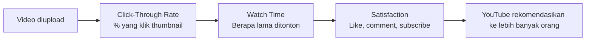

# Video Marketing & YouTube SEO

Video adalah format konten dengan engagement tertinggi. YouTube adalah mesin pencari terbesar kedua di dunia setelah Google.

## Mengapa Video?

```
Statistik yang perlu kamu tahu:
  → Video menghasilkan 1200% lebih banyak share dari teks + gambar
  → 68% orang lebih suka belajar dari video daripada teks
  → YouTube: 2 miliar pengguna aktif, 500 jam video diupload per menit
  → Rata-rata orang menonton 19 menit video per hari di YouTube
```

## Cara Kerja Algoritma YouTube



**Dua metric terpenting:** CTR dan Average View Duration (AVD).

## Thumbnail yang Diklik

Thumbnail menentukan apakah orang klik atau tidak:

```
Elemen thumbnail yang efektif:
  ✅ Wajah dengan ekspresi emosional (surprise, excitement)
  ✅ Teks besar dan kontras (max 3-4 kata)
  ✅ Warna yang mencolok dan konsisten dengan brand
  ✅ Kontras tinggi dengan thumbnail video lain di sekitarnya

Hindari:
  ❌ Terlalu banyak teks
  ❌ Warna yang sama dengan background YouTube (putih/abu)
  ❌ Clickbait yang tidak sesuai konten (merusak trust)
```

## Struktur Video yang Menahan Penonton

```
0:00-0:30  Hook — langsung ke inti, jangan intro panjang
           "Di video ini kamu akan belajar X dalam Y menit"

0:30-2:00  Setup — konteks dan mengapa ini penting

2:00-X:XX  Konten utama — dipecah dengan chapter/timestamp

X:XX-akhir CTA — subscribe, like, video berikutnya
```

**Retention curve:** YouTube Analytics menunjukkan di mana penonton drop-off. Perbaiki bagian dengan drop-off tinggi.

## YouTube SEO

```
Title (60 karakter):
  → Keyword di depan
  → "Cara Belajar Git untuk Pemula — Tutorial Lengkap 2026"

Description (pertama 150 karakter paling penting):
  → Ringkasan video + keyword
  → Timestamps/chapters
  → Link ke resource yang disebutkan
  → Link ke playlist terkait

Tags:
  → 5-10 tag relevan
  → Mix: broad + specific

Chapters (timestamps):
  → Tambahkan di description: "0:00 Intro\n2:30 Instalasi Git..."
  → Meningkatkan engagement dan SEO
```

## Produksi Video Sederhana

```
Setup minimal yang cukup:
  Kamera:    HP dengan kamera bagus (iPhone/Samsung flagship)
  Audio:     Mic clip-on Rp 50-150rb (audio > video quality)
  Lighting:  Ring light Rp 100-200rb atau dekat jendela
  Editing:   CapCut (gratis, mobile) atau DaVinci Resolve (gratis, PC)

Tips audio:
  → Rekam di ruangan dengan karpet/sofa (kurangi echo)
  → Jauh dari kipas angin dan AC
  → Test audio sebelum rekam panjang
```

## Latihan

1. Buat channel YouTube untuk Digital Lab
2. Rekam video tutorial 5-10 menit tentang topik tech yang kamu kuasai
3. Desain thumbnail di Canva menggunakan prinsip di atas
4. Optimasi title, description, dan tags untuk SEO
5. Analisis retention curve setelah 1 minggu — di mana penonton drop-off?
