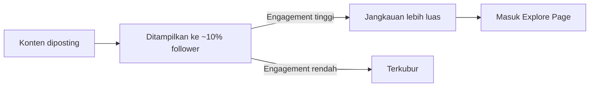

# Instagram & TikTok untuk Komunitas

Dua platform dengan jangkauan terbesar untuk Gen Z Indonesia — tapi strategi yang berbeda.

## Cara Kerja Algoritma

### Instagram



**Faktor yang mempengaruhi:**
- Engagement rate (like, comment, save, share) dalam 1 jam pertama
- **Save** dan **share** lebih berbobot dari like
- Konsistensi posting (algoritma reward akun yang konsisten)
- Relevansi konten dengan audiens

### TikTok

TikTok lebih demokratis — akun baru pun bisa viral:

```
Setiap video ditampilkan ke ~200-500 orang dulu
→ Jika completion rate tinggi → ditampilkan ke lebih banyak
→ Jika engagement baik → masuk For You Page (FYP)
```

**Faktor kunci TikTok:**
- **Watch time / completion rate** — paling penting
- Hook 3 detik pertama — harus langsung menarik
- Trending audio meningkatkan jangkauan
- Konsistensi (minimal 1 video/hari untuk growth cepat)

## Format Konten per Platform

### Instagram

| Format | Kekuatan | Kapan dipakai |
|--------|----------|---------------|
| Feed Post | Evergreen, profil terlihat rapi | Konten berkualitas tinggi |
| Carousel | Engagement tinggi (swipe = dwell time) | Tutorial, tips, listicle |
| Reels | Jangkauan organik terbesar | Edukasi singkat, behind scenes |
| Stories | Engagement personal, polling | Update harian, interaksi |

### TikTok

```
Hook (0-3 detik):  langsung ke inti, jangan intro panjang
Body (3-45 detik): konten utama, pace cepat
CTA (akhir):       "Follow untuk tips coding lainnya"

Durasi optimal: 15-60 detik untuk edukasi
```

## Caption yang Menggerakkan

```
❌ Buruk:
"Belajar Git yuk! #coding #programmer"

✅ Baik:
"Satu command Git yang mengubah cara saya bekerja 👇

git stash

Pernah lagi coding di tengah jalan tapi harus switch ke task lain?
git stash menyimpan perubahan sementara tanpa commit.

Cara pakainya:
1. git stash (simpan)
2. Kerjakan task lain
3. git stash pop (ambil kembali)

Simpan post ini biar tidak lupa! 🔖

#git #coding #programmingtips #belajarcoding #smauii"
```

**Struktur caption:**
1. Hook (baris pertama — yang terlihat sebelum "more")
2. Konten utama
3. CTA (save, comment, follow)
4. Hashtag (5-10 yang relevan)

## Hashtag Strategy

```
Mix 3 jenis hashtag:
  Besar (>1M post):  #coding #programming → jangkauan luas tapi kompetitif
  Sedang (100K-1M):  #belajarcoding #programmerindonesia → sweet spot
  Kecil (<100K):     #smauiilab #developeryogyakarta → niche, engagement tinggi
```

## Latihan

1. Analisis 3 akun komunitas tech Indonesia yang sukses di Instagram/TikTok
2. Catat: format apa yang paling banyak engagement? Caption seperti apa?
3. Buat 1 carousel Instagram tentang topik tech (min. 5 slide) menggunakan Canva
4. Rekam 1 video TikTok 30-60 detik tentang tips coding — perhatikan hook 3 detik pertama
5. Post keduanya dan catat engagement setelah 24 jam
