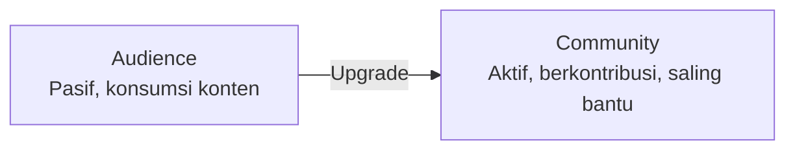

# Community Building & Engagement

Followers adalah audiens. Community adalah keluarga. Yang kedua jauh lebih powerful untuk pertumbuhan jangka panjang.

## Perbedaan Audience vs Community



| Audience | Community |
|----------|-----------|
| Menonton kontenmu | Membuat konten bersama |
| Pergi saat konten berhenti | Tetap ada karena koneksi antar anggota |
| Sulit dimonetisasi | Loyal, word-of-mouth kuat |
| Bergantung pada algoritma | Owned channel |

## Platform Community

| Platform | Kelebihan | Cocok untuk |
|----------|-----------|-------------|
| **Discord** | Real-time, channel terorganisir, bot | Tech community, gaming |
| **Telegram** | Mudah diakses, grup besar | Indonesia, informal |
| **WhatsApp** | Familiar, semua punya | Komunitas lokal, sekolah |
| **Circle/Mighty Networks** | Fitur lengkap, berbayar | Community berbayar |

**Rekomendasi untuk Digital Lab:** Discord (tech-friendly) + Telegram (aksesibilitas).

## Struktur Discord yang Baik

```
📢 ANNOUNCEMENTS
  #pengumuman
  #update-konten

💬 UMUM
  #perkenalan
  #obrolan-bebas
  #tanya-jawab

💻 TRACKS
  #software-engineering
  #ai-data-science
  #keamanan-siber
  #robotika-iot
  #desain-uiux

🚀 PROYEK
  #showcase-proyek
  #cari-kolaborator
  #feedback-proyek

📚 RESOURCES
  #link-berguna
  #buku-artikel
  #tools-gratis
```

## Strategi Engagement

### Onboarding yang Baik

```
Saat member baru join:
  1. Bot kirim pesan selamat datang otomatis
  2. Minta perkenalan di #perkenalan
  3. Assign role berdasarkan track yang diminati
  4. Tag ke channel yang relevan
```

### Konten yang Memancing Diskusi

```
❌ "Ini tutorial Git terbaru"
✅ "Kalian lebih suka Git GUI (GitKraken, SourceTree) atau CLI? Kenapa?"

❌ "Selamat hari Senin"
✅ "Senin motivation: apa 1 hal yang ingin kamu selesaikan minggu ini?"

❌ "Cek artikel baru kami"
✅ "Pertanyaan: kalau harus pilih 1 bahasa pemrograman untuk dipelajari 
    tahun ini, apa pilihanmu dan kenapa?"
```

### Gamifikasi Sederhana

```
Discord roles berdasarkan kontribusi:
  🌱 Newcomer    → baru join
  💻 Learner     → aktif di channel track
  🔥 Contributor → kontribusi ke smauii-dev-content
  ⭐ Mentor      → bantu anggota lain
  🏆 Core Team   → maintainer aktif
```

## Moderasi yang Sehat

```
Rules yang jelas:
  1. Hormati semua anggota
  2. Tidak ada spam atau promosi tanpa izin
  3. Pertanyaan di channel yang tepat
  4. Bahasa Indonesia atau Inggris

Moderasi proaktif:
  - Welcome message untuk member baru
  - Highlight kontribusi bagus
  - Tangani konflik dengan cepat dan privat
  - Buat event rutin (weekly challenge, study session)
```

## Metrics Community Health

```
Engagement rate:    % member yang aktif per minggu
Message volume:     pesan per hari (tren naik/turun)
Retention:          % member yang masih aktif setelah 30 hari
NPS:                "Seberapa besar kemungkinan kamu merekomendasikan komunitas ini?"
```

## Latihan

1. Setup server Discord untuk Digital Lab dengan struktur channel di atas
2. Buat 5 pertanyaan diskusi yang bisa diposting setiap hari Senin selama sebulan
3. Desain sistem role dan gamifikasi sederhana
4. Tulis welcome message yang personal dan mengundang partisipasi
5. Buat "community guidelines" dalam 1 halaman
