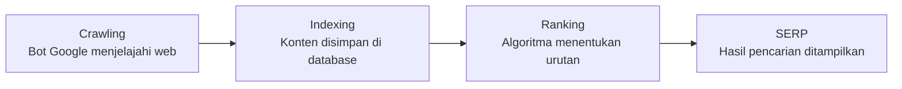

# SEO Dasar — Cara Kerja Mesin Pencari

SEO (Search Engine Optimization) adalah proses mengoptimasi website agar muncul di halaman pertama Google secara organik (gratis).

## Cara Kerja Google



**Faktor ranking utama:**
- **Relevansi** — seberapa relevan konten dengan query
- **Authority** — seberapa dipercaya website (backlink)
- **Experience** — kecepatan, mobile-friendly, UX

## Riset Keyword

Keyword adalah kata/frasa yang diketik pengguna di Google.

### Jenis Keyword

```
Short-tail:  "coding" → volume tinggi, kompetisi tinggi, intent tidak jelas
Long-tail:   "cara belajar coding untuk pemula SMA" → volume rendah, 
             kompetisi rendah, intent jelas, conversion lebih tinggi
```

**Selalu prioritaskan long-tail untuk website baru.**

### Tools Riset Keyword (Gratis)

```bash
# Google Search Console → keyword yang sudah mendatangkan traffic
# Google Keyword Planner → volume dan kompetisi
# Ubersuggest → alternatif gratis
# AnswerThePublic → pertanyaan yang orang tanyakan
# Google Autocomplete → ketik keyword, lihat saran Google
```

### Search Intent

Sebelum menulis konten, pahami intent di balik keyword:

| Intent | Contoh | Konten yang tepat |
|--------|--------|-------------------|
| Informational | "apa itu git" | Artikel penjelasan |
| Navigational | "github login" | Halaman login |
| Commercial | "platform belajar coding terbaik" | Comparison, review |
| Transactional | "daftar dicoding" | Landing page |

## On-Page SEO

Optimasi di dalam halaman:

```html
<!-- Title tag: 50-60 karakter, keyword di depan -->
<title>Belajar Git dari Nol — Panduan Lengkap untuk Pemula | Digital Lab</title>

<!-- Meta description: 150-160 karakter, mengundang klik -->
<meta name="description" content="Panduan lengkap belajar Git untuk pemula. 
Dari instalasi, commit pertama, hingga pull request. Cocok untuk siswa SMA 
yang baru mulai coding.">

<!-- Heading hierarchy -->
<h1>Belajar Git dari Nol</h1>        <!-- 1 per halaman, keyword utama -->
<h2>Apa itu Git?</h2>                 <!-- Subtopik utama -->
<h3>Perbedaan Git dan GitHub</h3>     <!-- Sub-subtopik -->

<!-- Alt text gambar -->


<!-- Internal linking -->
<a href="/belajar/github">Pelajari juga cara menggunakan GitHub →</a>
```

## Technical SEO Dasar

```
Kecepatan halaman:
  → Gunakan Google PageSpeed Insights untuk cek
  → Target: < 3 detik load time
  → Compress gambar (gunakan WebP)
  → Minify CSS/JS

Mobile-friendly:
  → Test di Google Mobile-Friendly Test
  → Responsive design wajib

HTTPS:
  → Wajib — Google penalti untuk HTTP
  → Let's Encrypt gratis

Sitemap:
  → Buat sitemap.xml
  → Submit ke Google Search Console
```

## Latihan

1. Buka Google Search Console untuk website Digital Lab (atau buat akun baru)
2. Riset 10 keyword yang relevan menggunakan Google Autocomplete + Ubersuggest
3. Pilih 1 keyword long-tail dan tulis outline artikel yang mengoptimasi keyword tersebut
4. Audit on-page SEO halaman utama Digital Lab — apa yang perlu diperbaiki?
