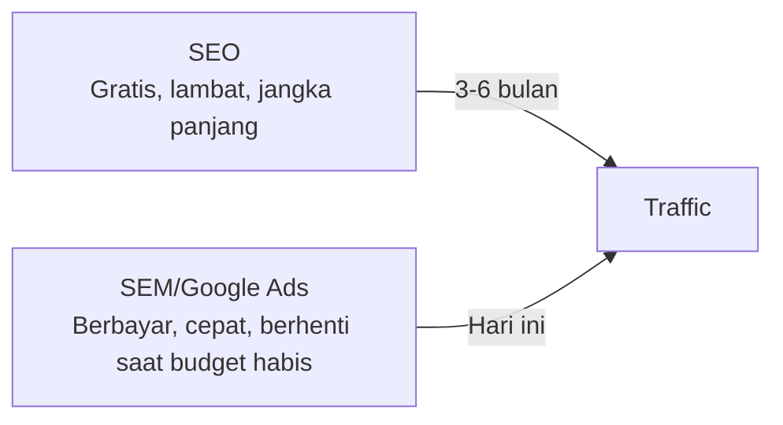

# Google Ads & SEM Dasar

SEM (Search Engine Marketing) adalah iklan berbayar di mesin pencari. Hasilnya instan — berbeda dengan SEO yang butuh waktu berbulan-bulan.

## SEO vs SEM



**Kapan pakai SEM:**
- Butuh traffic cepat (event, launch produk)
- Keyword kompetitif yang susah di-rank organik
- Testing pesan marketing sebelum invest di SEO

## Cara Kerja Google Ads

```
Kamu bid untuk keyword tertentu.
Saat orang search keyword itu, iklanmu bersaing dengan iklan lain.
Pemenang ditentukan oleh: Ad Rank = Bid × Quality Score

Quality Score (1-10) dipengaruhi:
  - CTR (Click-Through Rate) historis
  - Relevansi iklan dengan keyword
  - Landing page experience
```

**Artinya:** iklan yang relevan dan berkualitas bisa mengalahkan iklan dengan bid lebih tinggi.

## Struktur Campaign Google Ads

```
Account
└── Campaign (tujuan: awareness, traffic, conversion)
    └── Ad Group (tema keyword yang sama)
        ├── Keywords
        └── Ads (minimal 3 variasi)
```

## Menulis Iklan yang Efektif

```
Headline 1 (30 karakter): Belajar Coding Gratis
Headline 2 (30 karakter): Untuk Siswa SMA UII
Headline 3 (30 karakter): Mulai Hari Ini!

Description 1 (90 karakter): 
Bergabung dengan komunitas developer SMA UII. 
Belajar dari proyek nyata, bukan teori.

Description 2 (90 karakter):
Git, Python, Web Dev, AI — semua ada. 
Gratis untuk siswa SMA UII Yogyakarta.

Display URL: lab.smauiiyk.sch.id/daftar
```

**Tips:**
- Masukkan keyword di headline
- Highlight unique value proposition
- CTA yang jelas
- Match dengan landing page

## Keyword Match Types

```
Broad match:    coding          → muncul untuk "belajar programming", "kursus IT"
Phrase match:   "belajar coding" → muncul untuk "cara belajar coding gratis"
Exact match:    [belajar coding] → hanya untuk "belajar coding" persis
Negative:       -berbayar        → tidak muncul jika ada kata "berbayar"
```

**Untuk budget terbatas:** mulai dengan exact dan phrase match.

## Metrics yang Penting

| Metric | Rumus | Target |
|--------|-------|--------|
| CTR | Klik / Impresi × 100% | > 2% untuk search |
| CPC | Total biaya / Klik | Serendah mungkin |
| Conversion Rate | Konversi / Klik × 100% | > 3% |
| ROAS | Revenue / Ad Spend | > 3× |
| Quality Score | 1-10 | > 7 |

## Latihan

1. Buat akun Google Ads (gratis, bayar hanya saat ada klik)
2. Riset keyword untuk Digital Lab dengan Keyword Planner
3. Tulis 3 variasi iklan untuk keyword "belajar coding SMA"
4. Hitung: jika budget Rp 500.000/bulan dan CPC rata-rata Rp 2.000, berapa klik yang bisa didapat?
