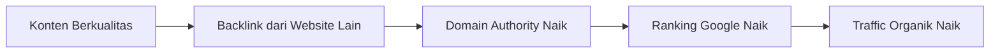

# Link Building & Off-Page SEO

Backlink adalah "vote of confidence" dari website lain. Semakin banyak website berkualitas yang link ke kamu, semakin tinggi authority dan ranking-mu.

## Mengapa Backlink Penting?

Google melihat backlink sebagai rekomendasi. Jika website terpercaya merekomendasikan kontenmu, Google menganggap kontenmu berkualitas.



## Jenis Backlink

| Jenis | Nilai | Cara Dapat |
|-------|-------|-----------|
| Editorial | Tinggi | Konten bagus yang di-link secara natural |
| Guest post | Sedang-Tinggi | Tulis artikel di website lain |
| Directory | Rendah | Daftar di direktori bisnis |
| Forum/Comment | Sangat rendah | Komentar dengan link |
| Paid | Berbahaya | Beli backlink — bisa kena penalti Google |

## Strategi Link Building yang Aman

### 1. Create Link-Worthy Content

Konten yang secara natural mendapat backlink:
- **Original research** — data yang tidak ada di tempat lain
- **Ultimate guides** — panduan paling lengkap tentang topik
- **Free tools** — kalkulator, generator, checker
- **Infografis** — data visual yang mudah di-share

### 2. Guest Posting

Tulis artikel untuk website lain, dapat backlink sebagai imbalan:

```
Cara mencari peluang guest post:
  Google: "write for us" + [topik]
  Google: "guest post" + [topik]
  Google: "submit article" + [topik]

Contoh untuk Digital Lab:
  → Blog komunitas developer Indonesia
  → Website pendidikan teknologi
  → Blog sekolah lain yang punya website
```

### 3. Broken Link Building

```
1. Temukan halaman dengan broken link (link yang sudah mati)
2. Buat konten yang menggantikan link yang mati tersebut
3. Hubungi pemilik website, beritahu broken link-nya
4. Tawarkan kontenmu sebagai pengganti
```

Tools: Ahrefs (berbayar) atau Check My Links (Chrome extension, gratis).

### 4. HARO (Help a Reporter Out)

Jurnalis mencari sumber untuk artikel mereka. Kamu bisa jadi sumber dan dapat backlink dari media:

```
1. Daftar di helpareporter.com
2. Terima email 3x sehari berisi pertanyaan jurnalis
3. Jawab pertanyaan yang relevan dengan expertise-mu
4. Jika dipilih → dapat mention + backlink di artikel
```

## Mengukur Authority

```python
# Tools untuk cek domain authority:
# Moz DA (Domain Authority): 0-100
# Ahrefs DR (Domain Rating): 0-100
# Majestic TF (Trust Flow): 0-100

# Cara cek gratis:
# - Moz Link Explorer (10 query/bulan gratis)
# - Ubersuggest (3 query/hari gratis)
# - Ahrefs Webmaster Tools (gratis untuk website sendiri)
```

## Local SEO untuk Digital Lab

Karena Digital Lab berbasis di Yogyakarta:

```
1. Daftar di Google Business Profile
2. Konsisten NAP (Name, Address, Phone) di semua platform
3. Minta review dari anggota komunitas
4. Optimasi untuk keyword lokal: "komunitas coding Yogyakarta"
5. Daftar di direktori lokal: Jogja Tech, komunitas IT Yogyakarta
```

## Latihan

1. Audit backlink website Digital Lab menggunakan Ahrefs Webmaster Tools (gratis)
2. Identifikasi 5 website yang relevan untuk guest posting
3. Tulis pitch email untuk 1 website target
4. Buat 1 konten "link-worthy" (infografis atau data original tentang komunitas tech SMA)
5. Setup Google Business Profile untuk Digital Lab
