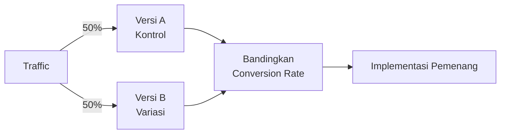

# A/B Testing & Growth Hacking

Growth hacking adalah mindset eksperimen cepat untuk menemukan cara tumbuh yang paling efisien.

## A/B Testing

Uji dua versi untuk menemukan mana yang lebih efektif:



### Apa yang Bisa Di-test?

```
Headline:     "Belajar Coding Gratis" vs "Mulai Karir Tech dari SMA"
CTA button:   "Daftar Sekarang" vs "Mulai Belajar Gratis"
Warna button: Biru vs Hijau
Form:         5 field vs 3 field
Email subject: "Tips coding minggu ini" vs "3 hal yang saya pelajari minggu ini"
```

### Cara Melakukan A/B Test yang Valid

```
1. Satu variabel per test (jangan ubah banyak hal sekaligus)
2. Sample size cukup (minimal 100 konversi per variasi)
3. Durasi cukup (minimal 1-2 minggu untuk menghindari bias hari)
4. Statistical significance ≥ 95% sebelum declare winner
```

**Tools gratis:** Google Optimize (deprecated), VWO (trial), atau manual split dengan UTM parameters.

## Growth Hacking Framework

### AARRR (Pirate Metrics)

```
Acquisition  → Bagaimana orang menemukan kamu?
Activation   → Apakah mereka mendapat "aha moment"?
Retention    → Apakah mereka kembali?
Revenue      → Apakah mereka membayar? (atau donasi, dll)
Referral     → Apakah mereka merekomendasikan?
```

Fokus pada metric yang paling "bocor" dulu.

### Growth Loop vs Funnel

```
Funnel (linear):
  Iklan → Landing page → Daftar → Aktif
  Masalah: harus terus bayar iklan untuk growth

Growth Loop (viral):
  User baru → Dapat nilai → Invite teman → Teman daftar → Dapat nilai → ...
  Keuntungan: growth organik, tidak perlu terus bayar
```

**Contoh growth loop untuk Digital Lab:**
> Siswa belajar → buat proyek → share di GitHub/LinkedIn → teman lihat → tertarik → daftar

### Viral Coefficient

$$k = i \times c$$

Di mana:
- $k$ = viral coefficient
- $i$ = rata-rata undangan per user
- $c$ = conversion rate undangan

Jika $k > 1$ → viral growth (setiap user membawa lebih dari 1 user baru)

## Eksperimen Cepat

Growth hacking = banyak eksperimen kecil, cepat, murah:

```
Minggu 1: Test headline berbeda di Instagram → mana yang CTR lebih tinggi?
Minggu 2: Test waktu posting (pagi vs malam) → mana yang engagement lebih tinggi?
Minggu 3: Test format konten (carousel vs reels) → mana yang reach lebih luas?
Minggu 4: Test CTA di bio Instagram → mana yang klik lebih banyak?
```

Dokumentasikan semua eksperimen:

```markdown
| Tanggal | Hipotesis | Variabel | Hasil | Kesimpulan |
|---------|-----------|----------|-------|------------|
| 17 Apr  | Carousel lebih engaging dari single post | Format | Carousel: 8.2% ER, Single: 3.1% ER | Gunakan carousel untuk konten edukasi |
```

## Latihan

1. Identifikasi metric yang paling "bocor" di funnel Digital Lab
2. Buat hipotesis: "Jika kita ubah X, maka Y akan meningkat karena Z"
3. Desain A/B test sederhana untuk menguji hipotesis tersebut
4. Hitung viral coefficient Digital Lab saat ini (estimasi berdasarkan data yang ada)
5. Buat rencana 4 eksperimen untuk bulan depan
