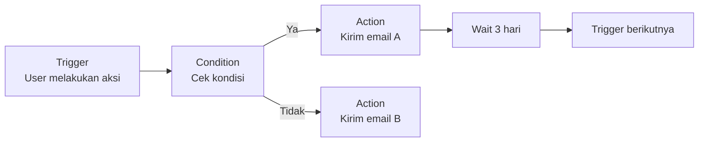
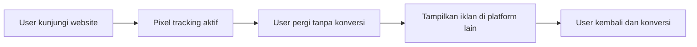

# Marketing Automation & Funnel Optimization

Marketing automation memungkinkan kamu menjalankan kampanye yang dipersonalisasi secara otomatis — tanpa harus manual setiap saat.

## Apa itu Marketing Automation?



**Contoh automation sederhana:**
```
Trigger: User daftar di Digital Lab
  → Kirim email welcome (langsung)
  → Tunggu 2 hari
  → Kirim email "Mulai dari mana?" dengan rekomendasi track
  → Tunggu 5 hari
  → Jika belum buka lesson pertama → kirim reminder
  → Jika sudah buka → kirim "Bagaimana progress-mu?"
```

## Conversion Rate Optimization (CRO)

CRO adalah proses meningkatkan persentase pengunjung yang melakukan aksi yang diinginkan.

### Heatmap Analysis

```python
# Tools: Hotjar, Microsoft Clarity (gratis)
# Heatmap menunjukkan:
#   - Di mana pengguna klik (click map)
#   - Seberapa jauh pengguna scroll (scroll map)
#   - Di mana mata pengguna fokus (attention map)

# Insight yang bisa didapat:
# "70% pengguna tidak scroll ke bawah fold pertama"
# → Pindahkan CTA ke atas
# "Pengguna banyak klik gambar yang tidak ada link-nya"
# → Tambahkan link ke gambar tersebut
```

### Session Recording

Rekam sesi pengguna untuk melihat friction points:

```
Tanda-tanda friction:
  - Rage clicks (klik berulang di tempat yang sama)
  - U-turns (kembali ke halaman sebelumnya)
  - Form abandonment (mulai isi form tapi tidak selesai)
  - Dead clicks (klik di area yang tidak interaktif)
```

## Retargeting

Tampilkan iklan ke orang yang sudah pernah mengunjungi website-mu:



**Segmentasi retargeting:**
```
Semua pengunjung → awareness ad
Pengunjung halaman /daftar → "Masih ragu? Ini yang kamu dapatkan..."
Pengunjung yang mulai isi form → "Kamu hampir selesai! Lanjutkan pendaftaran"
```

## Marketing Funnel Optimization

Identifikasi dan perbaiki bottleneck di setiap tahap:

```
Awareness:   1000 orang lihat konten
                ↓ 30% klik
Interest:    300 orang kunjungi website
                ↓ 40% explore lebih lanjut
Consideration: 120 orang baca tentang track
                ↓ 25% mulai daftar
Conversion:  30 orang selesai daftar (3% dari awareness)

Bottleneck terbesar: Awareness → Interest (70% drop)
→ Prioritas: perbaiki konten dan CTA di social media
```

## Tools Marketing Automation

| Tool | Gratis | Fitur |
|------|--------|-------|
| Mailchimp | Ya (500 sub) | Email automation, segmentasi |
| HubSpot | Ya (terbatas) | CRM, email, landing page |
| Make (Integromat) | Ya (1000 ops/bulan) | Workflow automation antar apps |
| Zapier | Ya (100 tasks/bulan) | Integrasi 5000+ apps |

## Contoh Automation dengan Make/Zapier

```
Trigger: Form registrasi disubmit (Typeform/Google Forms)
  → Tambah ke spreadsheet Google Sheets
  → Kirim email welcome via Mailchimp
  → Kirim notifikasi ke Discord #member-baru
  → Buat task di Notion untuk follow-up
```

## Latihan

1. Setup Microsoft Clarity (gratis) di website Digital Lab
2. Analisis heatmap setelah 1 minggu — temukan 3 friction point
3. Buat automation sederhana dengan Make/Zapier:
   - Form registrasi → email welcome → notifikasi Discord
4. Hitung conversion rate setiap tahap funnel Digital Lab
5. Identifikasi bottleneck terbesar dan buat hipotesis solusinya
