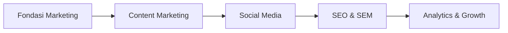

# Digital Marketing

Track ini mempersiapkan kamu untuk memahami dan menjalankan strategi pemasaran digital — skill yang dibutuhkan oleh hampir semua organisasi, startup, dan komunitas.

## Mengapa Digital Marketing?

Di era digital, produk terbaik pun bisa gagal jika tidak ada yang tahu keberadaannya. Digital marketing adalah jembatan antara produk dan audiens yang tepat.

> "Build it and they will come" sudah tidak berlaku. Yang berlaku sekarang: "Build it, market it, iterate."

## Relevansi untuk SMAUII Developer Foundation

Skill digital marketing langsung bisa diterapkan untuk:
- Mempromosikan proyek open source yang kamu buat
- Membangun personal brand sebagai developer
- Mengelola media sosial komunitas
- Menganalisis traffic website lab.smauiiyk.sch.id

## Roadmap

## Modul

1. **Fondasi Marketing** — Strategi, target audiens, buyer persona, funnel
2. **Content Marketing** — Copywriting, storytelling, content calendar
3. **Social Media** — Instagram, TikTok, LinkedIn, community building
4. **SEO & SEM** — Optimasi mesin pencari, Google Ads dasar
5. **Analytics & Growth** — Google Analytics, A/B testing, growth hacking

## Tools yang Digunakan

- **Canva** — desain konten (gratis)
- **Google Analytics** — analisis traffic
- **Google Search Console** — monitoring SEO
- **Buffer/Later** — scheduling social media
- **Ahrefs/Ubersuggest** — riset keyword

## Prasyarat

Tidak ada prasyarat teknis. Yang dibutuhkan:
- Rasa ingin tahu tentang perilaku manusia
- Kemampuan menulis yang baik
- Kemauan untuk bereksperimen dan mengukur hasilnya
