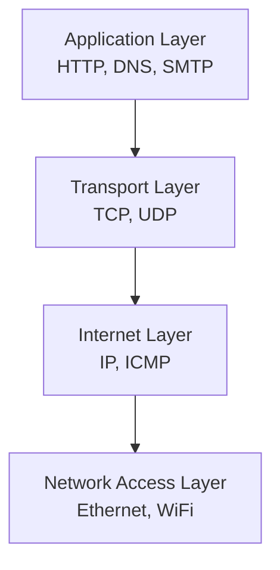

# Model OSI dan TCP/IP

Model OSI dan TCP/IP adalah kerangka konseptual yang menjelaskan bagaimana data berpindah melalui jaringan.

## Model OSI (7 Layer)

```
Layer 7 — Application   → HTTP, FTP, SMTP, DNS
Layer 6 — Presentation  → SSL/TLS, enkripsi, kompresi
Layer 5 — Session       → Manajemen sesi koneksi
Layer 4 — Transport     → TCP, UDP (port)
Layer 3 — Network       → IP, routing
Layer 2 — Data Link     → MAC address, Ethernet, WiFi
Layer 1 — Physical      → Kabel, sinyal, bit
```

**Mnemonik:** "**A**ll **P**eople **S**eem **T**o **N**eed **D**ata **P**rocessing"

## Model TCP/IP (4 Layer)



## TCP vs UDP

| | TCP | UDP |
|--|-----|-----|
| Koneksi | Connection-oriented | Connectionless |
| Keandalan | Guaranteed delivery | Best effort |
| Urutan | In-order | Tidak dijamin |
| Kecepatan | Lebih lambat | Lebih cepat |
| Penggunaan | HTTP, SSH, email | Video streaming, DNS, game |

## IP Address

### IPv4

```
192.168.1.100
│   │   │ │
│   │   │ └── Host (0-255)
│   │   └──── Subnet
│   └──────── Network
└──────────── Network class
```

**Private IP ranges:**
- `10.0.0.0/8` — Kelas A
- `172.16.0.0/12` — Kelas B
- `192.168.0.0/16` — Kelas C (paling umum di rumah)

### Subnetting Dasar

CIDR notation: `192.168.1.0/24`
- `/24` = 24 bit untuk network, 8 bit untuk host
- Jumlah host: $2^8 - 2 = 254$ host

### IPv6

```
2001:0db8:85a3:0000:0000:8a2e:0370:7334
```

128-bit address — mengatasi keterbatasan IPv4 (hanya 4 miliar alamat).

## Perintah Jaringan Dasar

```bash
# Cek IP address
ip addr show          # Linux
ipconfig              # Windows

# Ping — cek konektivitas
ping google.com
ping -c 4 8.8.8.8    # 4 kali ping

# Traceroute — lacak jalur paket
traceroute google.com
tracert google.com    # Windows

# DNS lookup
nslookup google.com
dig google.com

# Cek port yang terbuka
netstat -tulpn
ss -tulpn
```

## Latihan

1. Buka terminal, jalankan `ip addr show` (Linux) atau `ipconfig` (Windows)
2. Catat IP address lokal kamu
3. Ping `8.8.8.8` (Google DNS) — berapa latency-nya?
4. Jalankan `traceroute google.com` — berapa hop yang dilalui?
