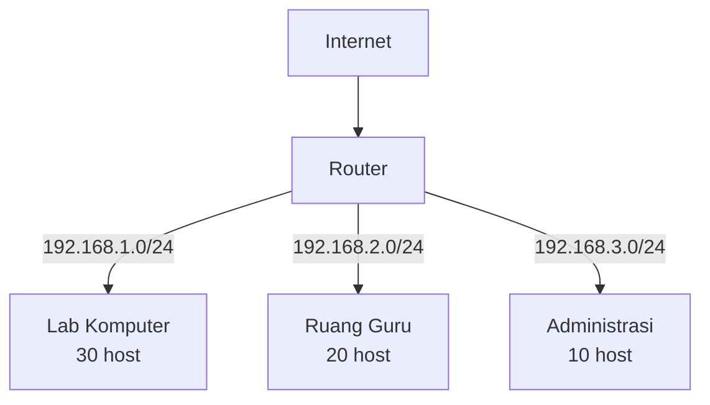
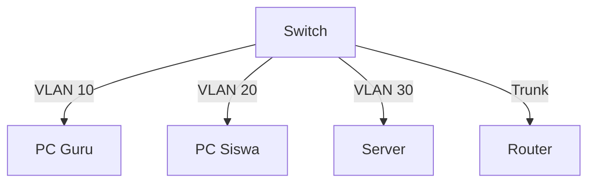

# Subnetting & VLAN

Subnetting membagi jaringan besar menjadi segmen lebih kecil untuk efisiensi dan keamanan.

## Subnetting

### Mengapa Subnetting?



### Hitung Subnet

**Formula:**
- Jumlah subnet: $2^n$ (n = bit yang dipinjam)
- Jumlah host per subnet: $2^h - 2$ (h = bit host tersisa)

**Contoh: 192.168.1.0/26**

```
/26 = 26 bit network, 6 bit host
Jumlah host: 2⁶ - 2 = 62 host per subnet
Jumlah subnet: 2² = 4 subnet (dari /24 ke /26)

Subnet 1: 192.168.1.0   - 192.168.1.63   (gateway: .1, broadcast: .63)
Subnet 2: 192.168.1.64  - 192.168.1.127  (gateway: .65, broadcast: .127)
Subnet 3: 192.168.1.128 - 192.168.1.191  (gateway: .129, broadcast: .191)
Subnet 4: 192.168.1.192 - 192.168.1.255  (gateway: .193, broadcast: .255)
```

### VLSM — Variable Length Subnet Mask

Alokasikan subnet sesuai kebutuhan aktual:

```
Kebutuhan:
- Lab Komputer: 30 host → /27 (30 host)
- Ruang Guru: 14 host → /28 (14 host)
- Administrasi: 6 host → /29 (6 host)
- Point-to-point: 2 host → /30 (2 host)

Alokasi dari 192.168.1.0/24:
192.168.1.0/27   → Lab (30 host)
192.168.1.32/28  → Guru (14 host)
192.168.1.48/29  → Admin (6 host)
192.168.1.56/30  → P2P link
```

## VLAN — Virtual LAN

VLAN memisahkan jaringan secara logis meskipun menggunakan switch fisik yang sama.



### Konfigurasi VLAN di Cisco Switch

```
! Buat VLAN
Switch(config)# vlan 10
Switch(config-vlan)# name GURU
Switch(config)# vlan 20
Switch(config-vlan)# name SISWA

! Assign port ke VLAN (access mode)
Switch(config)# interface fa0/1
Switch(config-if)# switchport mode access
Switch(config-if)# switchport access vlan 10

! Trunk port (ke router/switch lain)
Switch(config)# interface gi0/1
Switch(config-if)# switchport mode trunk
Switch(config-if)# switchport trunk allowed vlan 10,20,30
```

### Inter-VLAN Routing

```
! Router-on-a-stick
Router(config)# interface gi0/0.10
Router(config-subif)# encapsulation dot1q 10
Router(config-subif)# ip address 192.168.10.1 255.255.255.0

Router(config)# interface gi0/0.20
Router(config-subif)# encapsulation dot1q 20
Router(config-subif)# ip address 192.168.20.1 255.255.255.0
```

## Latihan

1. Hitung subnet untuk jaringan sekolah:
   - Lab 1: 30 komputer
   - Lab 2: 25 komputer
   - Ruang guru: 15 komputer
   - Kantor: 8 komputer
2. Gunakan Cisco Packet Tracer untuk simulasi VLAN
3. Konfigurasi inter-VLAN routing
