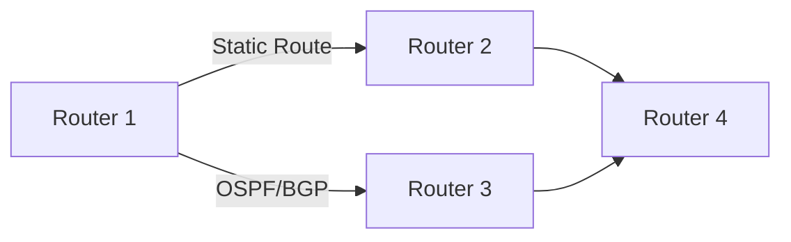
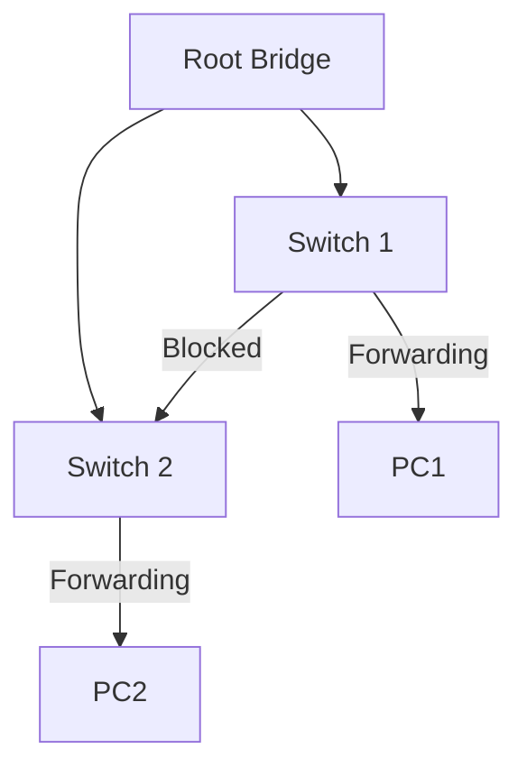

# Routing & Switching

Router menentukan jalur terbaik untuk paket data — otak dari jaringan modern.

## Static vs Dynamic Routing



**Static routing** — admin konfigurasi manual:
```
ip route 192.168.2.0 255.255.255.0 10.0.0.2
```

**Dynamic routing** — router belajar otomatis dari tetangga.

## OSPF — Open Shortest Path First

OSPF menggunakan algoritma Dijkstra untuk menemukan jalur terpendek:

$$\text{Cost} = \frac{10^8}{\text{Bandwidth (bps)}}$$

```
! Konfigurasi OSPF di Cisco
Router(config)# router ospf 1
Router(config-router)# network 192.168.1.0 0.0.0.255 area 0
Router(config-router)# network 10.0.0.0 0.0.0.3 area 0

! Verifikasi
show ip ospf neighbor
show ip route ospf
```

## Spanning Tree Protocol (STP)

STP mencegah loop di jaringan dengan memblokir link redundan:



```
! Konfigurasi STP
Switch(config)# spanning-tree mode rapid-pvst
Switch(config)# spanning-tree vlan 1 priority 4096  ! Jadikan root

show spanning-tree
```

## NAT — Network Address Translation

NAT memungkinkan banyak device menggunakan satu IP publik:

```
! PAT (Port Address Translation) — paling umum
ip nat inside source list 1 interface gi0/0 overload
access-list 1 permit 192.168.1.0 0.0.0.255

interface gi0/0
  ip nat outside

interface gi0/1
  ip nat inside

show ip nat translations
```

## Latihan

1. Simulasikan jaringan 3 router di Cisco Packet Tracer
2. Konfigurasi OSPF — pastikan semua bisa saling ping
3. Tambah NAT untuk akses internet
4. Verifikasi routing table: `show ip route`
