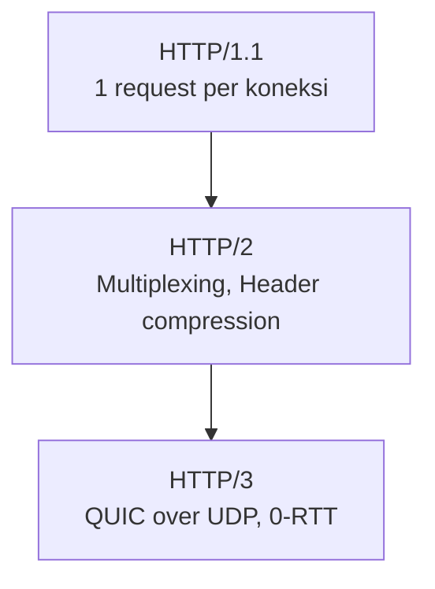
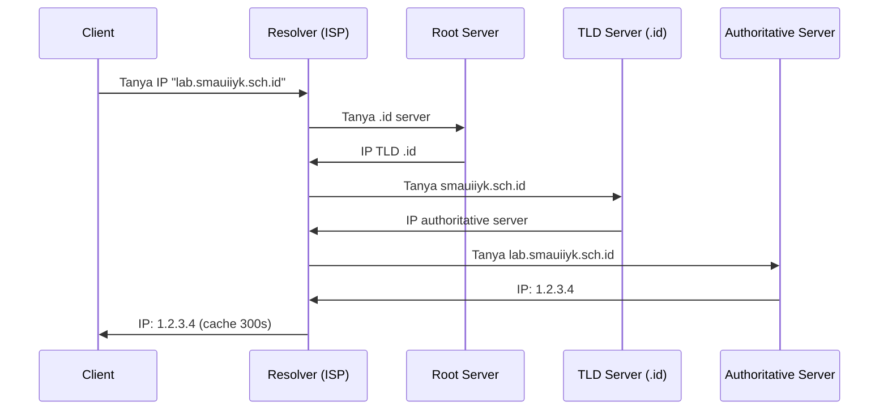

# HTTP, DNS, dan SSH

Tiga protokol yang paling sering kamu gunakan setiap hari — meski tidak sadar.

## HTTP/HTTPS

### Struktur Request

```
GET /learn/software-engineering HTTP/1.1
Host: lab.smauiiyk.sch.id
User-Agent: Mozilla/5.0
Accept: text/html
Authorization: Bearer eyJhbGc...
```

### Struktur Response

```
HTTP/1.1 200 OK
Content-Type: text/html; charset=utf-8
Content-Length: 1234
Cache-Control: max-age=3600

<!DOCTYPE html>...
```

### HTTP/2 vs HTTP/3



### Curl — HTTP dari Terminal

```bash
# GET request
curl https://api.github.com/users/sandikodev

# POST dengan JSON
curl -X POST https://api.example.com/login \
  -H "Content-Type: application/json" \
  -d '{"email": "test@example.com", "password": "secret"}'

# Lihat headers
curl -I https://lab.smauiiyk.sch.id

# Download file
curl -O https://example.com/file.zip
```

## DNS — Domain Name System

DNS adalah "buku telepon" internet — menerjemahkan nama domain ke IP address.



### Record Types

| Record | Fungsi | Contoh |
|--------|--------|--------|
| A | Domain → IPv4 | lab.smauiiyk.sch.id → 1.2.3.4 |
| AAAA | Domain → IPv6 | lab.smauiiyk.sch.id → 2001:db8::1 |
| CNAME | Alias domain | www → lab.smauiiyk.sch.id |
| MX | Mail server | smauiiyk.sch.id → mail.google.com |
| TXT | Verifikasi, SPF | "v=spf1 include:..." |
| NS | Name server | smauiiyk.sch.id → ns1.cloudflare.com |

```bash
# Lookup DNS
dig lab.smauiiyk.sch.id
dig MX smauiiyk.sch.id
nslookup -type=TXT smauiiyk.sch.id

# Trace DNS resolution
dig +trace lab.smauiiyk.sch.id
```

## SSH — Secure Shell

SSH mengenkripsi semua komunikasi antara client dan server.

### Autentikasi Key-Based

```bash
# 1. Generate key pair
ssh-keygen -t ed25519 -C "sandi@smauii"
# Menghasilkan: ~/.ssh/id_ed25519 (private) + ~/.ssh/id_ed25519.pub (public)

# 2. Copy public key ke server
ssh-copy-id -i ~/.ssh/id_ed25519.pub user@server.com

# 3. Connect (tanpa password!)
ssh user@server.com
```

### SSH Tunneling

```bash
# Local port forwarding — akses service di server via lokal
ssh -L 8080:localhost:3000 user@server.com
# Sekarang localhost:8080 → server:3000

# Remote port forwarding — expose lokal ke server
ssh -R 9090:localhost:3000 user@server.com

# SOCKS proxy
ssh -D 1080 user@server.com
```

### Hardening SSH

```bash
# /etc/ssh/sshd_config
PermitRootLogin no          # Jangan izinkan login root
PasswordAuthentication no   # Hanya key-based auth
Port 2222                   # Ganti port default
MaxAuthTries 3              # Batasi percobaan login
AllowUsers sandi deploy     # Whitelist user

systemctl restart sshd
```

## Latihan

1. Analisis traffic HTTP dengan Wireshark — filter `http.request`
2. Setup DNS record untuk domain kamu (gunakan Cloudflare gratis)
3. Hardening SSH server: disable password auth, ganti port, setup fail2ban
